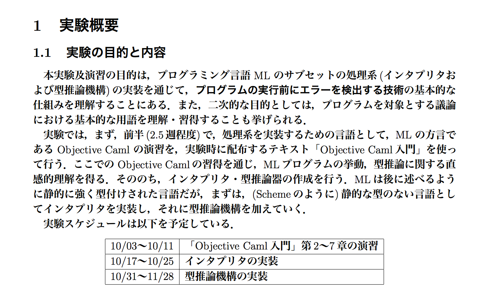

# 実装 関数型言語

田中　祥太郎

---

お詫び

---

当初の題目

「実装 型推論」

---

1. OCamlでOCamlの対話型インタプリタ（REPL）を実装
2. できたインタプリタに型推論機構を付与

---

# FP無関係

---

# ていうか無理

---

1. OCamlでOCamlの対話型インタプリタ（REPL）を実装
2. ~~できたインタプリタに型推論機構を付与~~

---

後半は

**0x64物語 第n夜 「型」**

をお楽しみに！

---

〜本編〜

---

大学3年の10月

---

 

---

型推論を実装するために

**まずOCamlのインタプリタを実装**

---

思い出しながら頑張って解説します

---

OCaml

* 強静的型付け関数型言語
* 副作用を許容
  * 普通に try ~ with とかある
* Haskellとの比較
  * 型システムの表現力は低い（型クラスが無い）
  * （基本的な）型システムの完全性を保証
* 完全性と健全性
  * 健全性: 型推論が成功する → 実行時に型エラーが発生しない
  * 完全性: 実行時に型エラーが発生しない → 型推論が成功する

---

雰囲気

```ocaml
let rec fact n =
  if n = 0 then 1 else n * fact (n-1)

fact 5

let sum_of_first_two l =
  match l with
      [] -> 0
    | x :: [] -> x
    | x :: y :: rest -> x + y
```

---

今回

* OCamlのサブセットminimlを実装
  * int, bool
  * 単項・二項・三項演算
  * let, let rec
  * 関数
* インタプリタ
  * 環境渡しインタプリタ
  * REPLをつくる

---

インタプリタ

1. 構文木の生成
2. 評価
3. 結果の出力

---

構文木の生成

* ソースコード -> 抽象構文木
* 字句解析: ocamllex
* 構文解析: ocamlyacc
* 今回は構文定義だけ紹介します

---

構文定義: syntax.ml #1

```ocaml
type id = string

type binOp = Plus | Minus | Mult | Div | Mod | Lt | Le | Mt | Me | Eq | Ne | BoolOr | BoolAnd

type unOp = Neg | BoolNot
```

---

構文定義: syntax.ml #2

```ocaml
type exp =
    Var of id
  | ILit of int
  | BLit of bool
  | UnOp of unOp * exp
  | BinOp of binOp * exp * exp
  | IfExp of exp * exp * exp
  | LetExp of id * exp * exp
  | LetRecExp of id * id * exp * exp
  | FunExp of id * exp
  | AppExp of exp * exp

type program =
    Exp of exp
  | Decl of id * exp
  | RecDecl of id * id * exp
```

---

評価

* 環境渡しインタプリタ
  * 環境の下で、抽象構文木で表現された式を計算
* 環境: 変数束縛のリスト

---

環境: environment.ml

```ocaml
type 'a t = (Syntax.id * 'a) list

exception Not_bound

let empty = []

let extend x v env = (x,v) :: env

let rec lookup x env =
  try List.assoc x env with Not_found -> raise Not_bound
```

---

インタプリタ: main.ml

```ocaml
open Syntax
open Eval

let rec read_eval_print env =
  print_string "# ";
  flush stdout;
  let decl = Parser.toplevel Lexer.main (Lexing.from_channel stdin) in
  let (id, newenv, v) = eval_decl env decl in
    Printf.printf "val %s = " id;
    pp_val v;
    print_newline();
    read_eval_print newenv

let _ = read_eval_print Environment.empty
```

---

評価: eval.ml #1

* 単項・二項演算

```ocaml
let rec apply_prim_unOp op arg = match op, arg with
    Neg, IntV i      -> IntV (- i)
  | Neg, _           -> err ("An argument must be integer: -")
  | BoolNot, BoolV b -> BoolV (not b)
  | BoolNot, _       -> err ("An argument must be boolean: not")

let rec apply_prim_binOp op arg1 arg2 = match op, arg1, arg2 with
    Plus, IntV i1, IntV i2  -> IntV (i1 + i2)
  | Plus, _, _              -> err ("Both arguments must be integer: +")
  | ...
```

---

評価: eval.ml #2

* 変数, リテラル, 単項・二項演算式

```ocaml
let rec eval_exp env = function
    Var x ->
      (try Environment.lookup x env
      with Environment.Not_bound -> err ("Variable not bound: " ^ x))
  | ILit i -> IntV i
  | BLit b -> BoolV b
  | UnOp (op, exp) ->
      let arg = eval_exp env exp in
        apply_prim_unOp op arg
  | BinOp (op, exp1, exp2) ->
      let arg1 = eval_exp env exp1 in
      let arg2 = eval_exp env exp2 in
        apply_prim_binOp op arg1 arg2
  | ...
```

---

評価: eval.ml #3

* 三項演算子 `if exp1 then exp2 else exp3`

```ocaml
  | ...
  | IfExp (exp1, exp2, exp3) ->
      let test = eval_exp env exp1 in
        (match test with
            BoolV true  -> eval_exp env exp2
          | BoolV false -> eval_exp env exp3
          | _           -> err ("Argument (1) must be of boolean: if (1) then (2) else (3)"))
  | ...
```

---

評価: eval.ml #4

* let式 `let id = exp1 in exp2`
* 変数束縛を追加した新たな環境の中で式を評価

```ocaml
  | ...
  | LetExp (id, exp1, exp2) ->
      let value = eval_exp env exp1 in
        eval_exp (Environment.extend id value env) exp2
  | ...
```

---

評価: eval.ml #5

* 関数と関数適用
* 環境への参照を持つことで関数閉包（クロージャ）を実現 `ProcV`
* 関数適用の際はクロージャがもつ環境をextendした中で評価

```ocaml
  | ...
  | FunExp (para, exp) -> ProcV (para, exp, ref env)
  | AppExp (exp1, exp2) ->
      let funval = eval_exp env exp1 in
      let arg = eval_exp env exp2 in
        (match funval with
            ProcV (id, body, env_ref) ->
              let newenv = Environment.extend id arg !env_ref in
                eval_exp newenv body
          | _ -> err ("Non-function value is applied"))
```

---

評価: eval.ml #5

* let rec式 `let rec id para = exp1 in exp2`
* 再帰的関数定義（exp1の中でidが出現する）
* 一時的に空の環境をダミーとして参照し、評価時に付け替える

```ocaml
  | ...
  | LetRecExp (id, para, exp1, exp2) ->
      let dummyenv = ref Environment.empty in
      let newenv = Environment.extend id (ProcV (para, exp1, dummyenv)) env in
        dummyenv := newenv;
        eval_exp newenv exp2
  | ...
```
---

評価: eval.ml #6

* 宣言

```ocaml
let eval_decl env = function
    Exp exp ->
      let value = eval_exp env exp in ("-", env, value)
  | Decl (id, exp) ->
      let value = eval_exp env exp in (id, Environment.extend id value env, value)
  | RecDecl (id, para, exp) ->
      let dummyenv = ref Environment.empty in
      let value = ProcV (para, exp, dummyenv) in
      let newenv = Environment.extend id value env in
        dummyenv := newenv;
        (id, newenv, value)
```

---

できた！！！

---

# デモ

---

型推論はついてない

```
# 1 + true;;
Fatal error: exception Eval.Error("Both arguments must be integer: +")
```

---

第n夜をお楽しみに！
