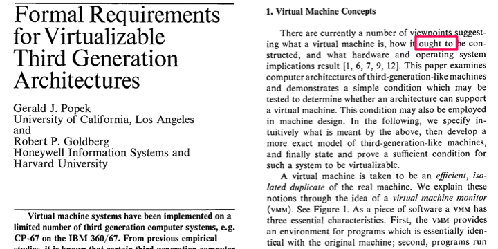
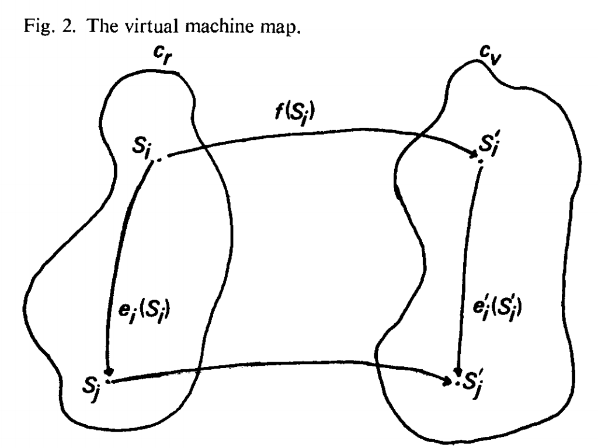

<!-- $theme: gaia -->

### Formal Requirements

### for Virtualizable

### Third Generation Architectures

###### 0x64#10

##### @yubessy

---

#### プロセスVMではなく

#### システムVMの話です

---

#### とあるエンジニアの週末

* 久しぶりに自作PCでもつくろう

---

#### とあるエンジニアの週末

* 久しぶりに自作PCでもつくろう
* Corei7とか買ってきても面白くない

---

#### とあるエンジニアの週末

* 久しぶりに自作PCでもつくろう
* Corei7とか買ってきても面白くない
* せっかくなのでCPUをつくろう！

---

#### とあるエンジニアの週末

* 久しぶりに自作PCでもつくろう
* Corei7とか買ってきても面白くない
* せっかくなのでCPUをつくろう！
* x86と同じものつくっても面白くない

---

#### とあるエンジニアの週末

* 久しぶりに自作PCでもつくろう
* Corei7とか買ってきても面白くない
* せっかくなのでCPUをつくろう！
* x86と同じものつくっても面白くない
* せっかくなので命令セットを組もう！

---

# WAIT

---

###### そのアーキテクチャ、

# 仮想化できますか？？？

---

##### Formal Requirements

##### for Virtualizable Third Generation Architectures

Popek, Gerald J., and Goldberg, Robert P.

Communications of the ACM 17.7 (**1974**): 412-421.

---

#### 論文の内容

* 仮想化機構に求められる特性を定義
* 第三世代アーキテクチャのコンピュータの形式的な計算モデルを定義
* 第三世代アーキテクチャの命令セット中の
  仮想化に関連する命令に対する分類を導入
* 第三世代アーキテクチャで**仮想化機構を構築する
  ために命令セットが満たすべき十分条件を導出**

※第三世代アーキテクチャ：
 当時の最先端アーキテクチャの総称（x86の源流）

---

###### 素朴な疑問

#### 仮想化できないアーキテクチャってあるの？

###### チューリング完全ならエミュレーションできるでしょ？

---

#### エミュレーション vs. 仮想化

共通点: あるコンピュータ上で
別のコンピュータを動作させること

||エミュレーション|仮想化|
|---|---|---|
|アーキテクチャ|ゲストとホストで異なる|ゲストとホストで同じ|
|ホストの役割|ゲストの命令の解釈・翻訳・実行|ゲストのリソース利用を監視・管理|
|ゲストの命令実行|ホストが解釈・翻訳・実行|一部を除いて透過的に実行|

---

#### エミュレーション vs. 仮想化

エミュレーション (Emulation) = **代理**

* ゲストが発行する命令を逐一代わりに実行

仮想化 (Virtualization) = **監視**

* ゲストが権限のない命令を発行したときのみ介入

→ **仮想化はオーべーヘッドが少ない**

※ここでの「仮想化」は
 現代でいう「ハードウェア仮想化」に近い

---

#### 仮想化機構に求められる特性

仮想化機構を実現するプログラムを仮想マシンモニタ（**VMM**）と呼ぶ
e.g. VMware, VirtualPC, VirtualBox, ...

VMMとそれが作り出す仮想環境は次の特性を
持たなければならない

1. 等価性(Equivalence)
2. 資源の管理(Resource Control)
3. 効率性(Efficiency)

---

#### 特性1: 等価性(Equivalence)

> VMMの元で動作するプログラムは、等価な実際のマシン上で直接実行した場合と本質的に同じ振る舞いを示さなければならない

OSやアプリケーションが、VM上で実行された場合と
通常のハードウェア上で実行された場合とで同じように動作する

→ **VMが正しく動作するための特性**

---

#### 特性2: 資源の管理(Resource Control)

> VMMは仮想化された資源を完全にその管理下におかなければならない

VMMが、VMに提供する(仮想)プロセッサや
(仮想)メモリなどを全てコントロール可能である

→ **VMが安全に動作するための特性**

---

#### 特性3: 効率性(Efficiency)

> 統計的に大部分の機械の命令を VMM の介在なく実行できなければならない

VMが(仮想)プロセッサに発行する命令の多くを
VMMの介入なく直接(物理)プロセッサで実行できる

→ **VMが効率的に動作するための特性**

※統計的に大部分: 命令セット中の割合ではなく、実行時の割合

---

#### 仮想化可能なアーキテクチャ

PopekとGoldbergは、以上の3特性を満たすもの
だけが完全な仮想化機構であるとした

では、どんなアーキテクチャなら完全な仮想化機構を
構築できるVMM(完全なVMM)を実現できるか？

PopekとGoldbergは、**第三世代アーキテクチャ**の
コンピュータの計算モデルを形式的に定義し、
**命令セットがある要件を満たせば**完全なVMMを
実現できることを証明した

---

#### 命令の分類

完全な仮想化機構を実現するために命令セットが
満たすべき十分条件を**仮想化要件**とよぶ

仮想化要件を簡潔に表現するため、命令セット中の
仮想化に関わる関連する命令に対して次の分類を導入

* 特権命令
* センシティブ命令
  * 制御センシティブ命令
  * 動作センシティブ命令

---

#### 特権命令

> その命令を実行しようとした時、プロセッサがユーザーモードにあれば、トラップされる命令

トラップ: マシンの現在の状態を保存した上で
マシンの制御をスーパバイザモードに移行すること

= 実行のために **特権(privillage)** が必要な命令

---

#### センシティブ命令

* 制御センシティブ命令

> システム資源の構成を変えようとする命令

* 動作センシティブ命令

> システムの資源の構成に結果が依存する命令

※システム資源: プロセッサモード・メモリサイズ等

---

#### 定理: PopekとGoldbergの仮想化要件

> **全てのセンシティブ命令が特権命令ならば
  完全なVMM を構築することができる**

システム資源の構成に影響を与えるor受ける命令は
常にVMMに制御を渡して実行される

→ 直接的に**資源の管理**を保証

（逆に）非特権命令はシステム資源の構成に関係ないのでVMMの介入なしに直接実行できる

→ 間接的に**効率性**を保証

---

#### 証明の骨子

全てのセンシティブ命令が特権命令ならば
資源の管理・効率性が保証されることは明らか

証明すべきこと：
「全てのセンシティブ命令が特権命令であるという条件下で、等価性の保証されるVMMが構築できる」

→ **実際にVMMの構築手順を示し、それが等価性を
保証していることを示す**

※NOTE: 以下時間なければ割愛

---

#### 第三世代コンピュータの計算モデル

* S = \<E, M, P, R\>: (状態機械における)状態
  * E: 主記憶
  * **M: モード (supervisor/user)**
  * P: プログラムカウンタ
  * **R: 再配置レジスタ**
* i: 命令
  * i(S1) = S2: 命令iによるS1からS2への状態遷移 

※I/Oや割り込みは考慮しない

---

#### 再配置レジスタ (Reallocation Register)

現在のメモリ空間のベースアドレスとサイズを保持

* R = (l, b)
  * l: ベースアドレス
  * b: サイズ

物理アドレス = 論理アドレス + ベースアドレス

ベースアドレスを変化させることで、プログラムに
割り当てるメモリ空間を切り替えることが可能
= **VMに割り当てるメモリ空間を隔離できる**

---

#### トラップ

命令 i が次の条件をみたすとき、i はトラップである

* E' (=iの実行後のメモリ) に
  E, M, P, R (=iの実行前の状態の全構成要素)
  が保存される
* M' = *supervisor*
* R' = (0, q - 1) (全メモリ空間)

※X'は命令実行後の各変数の値
※qは最大メモリサイズ

---

#### 特権命令・センシティブ命令

* 特権命令
  * M = *user* ⇔ i: *trap*
* 制御センシティブ命令
  * M ≠ M' ∨ R ≠ R'
* 動作センシティブ命令
  * ∃ R1, R2 s.t. R1 ≠ R2 → E'1 ≠ E'2 ∨ P'1 ≠ P'2

※厳密には多少異なる

---

#### 等価性とVM map

* C: 状態機械が取りうる状態の全集合
* Cv: 状態機械上にVMMが存在して
  状態機械の制御を掌握している状態の集合
* Cr: C - Cv

等価性の保証
⇔ Cr から Cv への**単射かつ準同型な写像** f が存在

i.e. VMMが居る状況(Cv)で
  VMMが**居ないように見える**状況を作り出せる

この写像 f を**VM map**と呼ぶ

---

---

### VM mapの存在証明

論文ではVM mapの存在性のみ証明
※実際にはアーキテクチャ毎にいい感じのを作る

* 全ての命令の効果はM, P, RおよびEのうちRで指定された部分のみに依存
* これらで表現できる状態数は高々有限個
* **全ての特権命令と全ての状態について**
  fの適用後の状態を定義したテーブルを作ればよい

---

# ＿人人人人人人人＿
# ＞　効率性とは　＜
# ￣Y^Y^Y^Y^Y^Y￣

---

#### 閑話休題: x86仮想化

* ('78) x86アーキテクチャの登場
  * 当初は仮想化要件を満たしていなかった
* ('99) VMware Virtual Platform の登場
  * 一部の動的命令変換によるオーバーヘッド
* ('05-'06) HAV (Hardware-Assisted Virtualization)
  の登場
  * Intel Virtualization Technology
  * AMD Virtualization
  * **仮想化要件を満たすようx86を拡張**

---

###### 自分で命令セットを組むときは

###### ぜひ思い出してみてくださいね！
