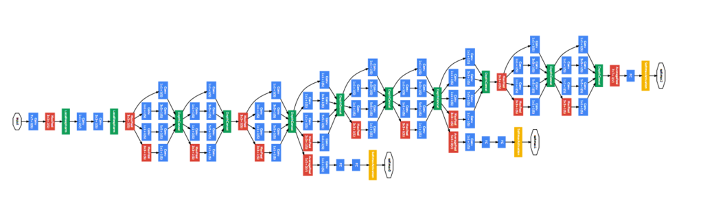
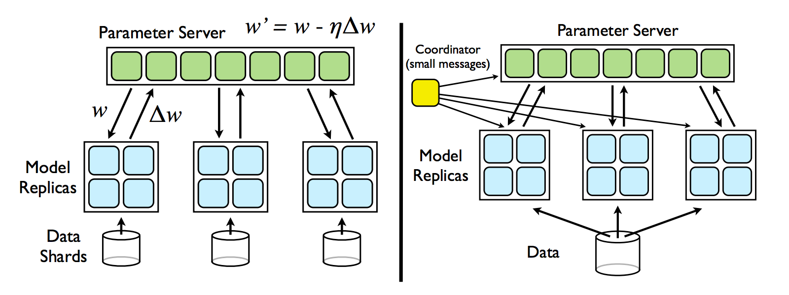

<!-- $theme: gaia -->

## Distributed Deep Newral Networks

###### 0x64物語 reboot 第01夜 "Network"

#### @yubessy

---

###### 今日の話

## ニューラルネットワーク

## x

## 分散コンピューティング

---

### Why Distributed?

* データ量の増加
  * テキスト < 画像 < 動画
* 計算量の増加
  * いわゆるディープラーニング
* 単一マシンの処理能力の頭打ち

##### -> 時代は分散コンピューティング

---

### 分散コンピューティングの歩き方

* **分散対象**: 何を分けるか
  * そもそも分割できるのか
  * 負荷を均等化できるか
* **アーキテクチャ**: どうつなぐか
  * クライアント・サーバ型 / メッシュ型 / ...
  * 同期 / 非同期
  * スループット / レイテンシ
  * プロトコル

---

### 深層ニューラルネット (DNN)

* 多数のレイヤを接続した有向グラフ
* Back Propagation (BP)
  * 入力値に対する、モデルの出力値と正解値の
    差分を求める
  * 差分が小さくなるよう、出力側から順に
    各レイヤのパラメータを調整
* Stochastic Gradient Descent (SGD)
  * データ点を１つずつ与えながらモデルを学習

---

### 深層ニューラルネット (DNN)



<div style="font-size: 16pt; text-align: center;">From http://joelouismarino.github.io/blog_posts/blog_googlenet_keras.html</div>

---

### DNNと分散処理

* DNNは分散処理に向いている
  * モデル並列化 = 計算グラフを複数の部分に分割
  * データ並列化 = データを分割しノード毎にSGD
* "Large Scale Distributed Deep Networks"
  Dean, et al. 2012.
  * By Google
  * DNNのモデル / データ並列化両方について解説

---

### モデル並列化

* 分散対象 = DNNのグラフ
  * グラフ全体を部分グラフに分割
  * 各部分グラフを別々のノードに割り当て
* アーキテクチャ = メッシュ型
  * 元のグラフで結合されていた部分が
    ノードをまたいで通信
* ボトルネック
  * 適切に分割しないと
    ノード間のトラフィックがえらいことに

---

### モデル並列化


<div style="text-align: center; font-size: smaller;">
Dean, et al. [1] Figure 1
</div>

---

### データ並列化

* 分散対象 = 学習データ
  * データをチャンクに分割
  * 各チャンクを別々のノードに処理させる
* アーキテクチャ = Parameter Server (PS) 方式
  * PSノードが各レイヤのパラメータを保持
  * ワーカーノードは一定量の学習を終えるごとに
    非同期通信によりパラメータを更新
* ボトルネック
  * ワーカが増えるとPSノードの負荷が高くなる

---

### データ並列化



<div style="text-align: center; font-size: smaller;">
Dean, et al. [1] Figure 2
</div>

---

### Distributed TensorFlow

* ここまで説明した分散処理機能が
  実はすでに TensorFlow に組み込まれている
  * 🔎 Distributed TensorFlow
* ノード間はgRPCで通信

<div style="text-align: right;">

</div>

---

## 雰囲気だけ紹介

---

### クラスタ定義

```python
cluster = tf.train.ClusterSpec({
    # ワーカー (データ分散)
    "worker": [
        "worker0.example.com:2222",
        "worker1.example.com:2222",
        "worker2.example.com:2222"
    ],
    # パラメータサーバ (モデル分散)
    "ps": [
        "ps0.example.com:2222",
        "ps1.example.com:2222"
    ]})
```

---

### モデル並列化

* レイヤを複数のPSに分散

```python
# 同じPSに乗せたいパラメータ群を tf.device でくくる
with tf.device("/job:ps/task:0"):
  weights_1 = tf.Variable(...)
  biases_1 = tf.Variable(...)

# タスクの番号に応じてラウンドロビンでPSが決まる
with tf.device("/job:ps/task:1"):
  weights_2 = tf.Variable(...)
  biases_2 = tf.Variable(...)
```

---

### データ並列化

* 各ワーカーに同じグラフを複製

```python
# replica_device_setter で
# 複数のワーカに同じグラフを複製
with tf.device(tf.train.replica_device_setter(
    worker_device="/job:worker/task:%d" % task_index,
    cluster=cluster)):
    input, labels = ...
    layer_1 = tf.nn.relu(
        tf.matmul(input, weights_1) + biases_1)
    logits = tf.nn.relu(
        tf.matmul(layer_1, weights_2) + biases_2)
    train_op = ...
```

---

### まとめ

* NNは分散コンピューティングと相性がよい
* モデル並列化 / データ並列化
* TensorFlow 最強

---

### 参考

* [1] [Large Scale Distributed Deep Networks](http://www.cs.toronto.edu/~ranzato/publications/DistBeliefNIPS2012_withAppendix.pdf)
* [2] [Distributed TensorFlow](https://www.tensorflow.org/deploy/distributed)
* [3] [Distributed TensorFlowを試してみる](http://qiita.com/ashitani/items/2e48729e78a9f77f9790)
* [4] [Distributed TensorFlowの話](http://qiita.com/kazunori279/items/981a8a2a44f5d1172856)
