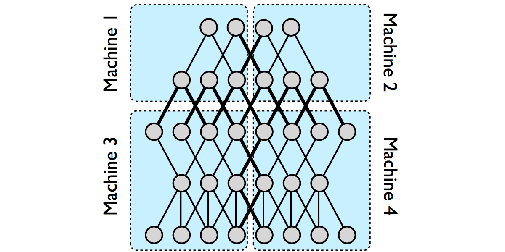

<!-- $theme: gaia -->

## Distributed Deep Newral Network

###### 0x64物語 reboot 第01夜 "Network"

#### Shotaro Tanaka (@yubessy)

---

###### 今日の話

## ニューラルネットワーク

## x

## 分散コンピューティング

---

### Why Distributed?

* データ量の増加
  * テキスト < 画像 < 動画
* 計算量の増加
  * いわゆるディープラーニング
* 単一マシンの処理能力の頭打ち

##### -> 時代は分散コンピューティング

---

### Why Network?

* 分散コンピューティング
  * 複数のノードがひとつの目的の計算を行う
* アーキテクチャ
  * 何を分散させるか
  * 分散したもの同士をどうつなぐか

##### -> ネットワークアーキテクチャが重要

---

### 分散コンピューティングの歩き方


* **分散対象**: 何を分けるか
  * そもそも分割できるのか
  * 負荷を均等できるか
* **ノード間通信**: どうつなぐか
  * クライアント・サーバ型 / ワーカー間通信
  * 同期 / 非同期
  * スループット / レイテンシ
  * プロトコル

---

### 深層ニューラルネット (DNN)

* 多数のレイヤを接続した有向グラフ
* Back Propagation (BP)
  * 入力値に対する、グラフの出力値と正解値の
    差分を求める
  * 差分が小さくなるよう、出力側から順に
    各レイヤのパラメータを調整
* Stochastic Gradient Descent
  * データ点を１つずつ与えながら
    各レイヤのパラメータを更新

---

### 深層ニューラルネット (DNN)


<div style="font-size: 16pt; text-align: center;">From http://joelouismarino.github.io/blog_posts/blog_googlenet_keras.html</div>

---

### DNNと分散処理

* DNNは分散処理に向いている
  * モデル並列 = 計算グラフを複数の部分に分割
  * データ並列 = SGDをノード毎に並列化
* "Large Scale Distributed Deep Networks" 
  Dean, et al. 2012.
  * By Google
  * DNNのモデル / データの並列処理について解説
  * ~~またお前か~~

---

### モデル並列

* 分散対象 = ニューラルネットのグラフ
  * モデルを部分グラフに分割
  * 各部分グラフを別のワーカーに割り当て
* ノード間通信 = ワーカー間の直接通信
  * 元のモデルで結合されていた部分が
    ノードをまたいで通信
* ボトルネック
  * 適切に分割しないと
    ノード間のトラフィックがえらいことに

---

### モデル並列



<div style="text-align: center; font-size: smaller;">
Dean, et al. [1] Figure 1
</div>

---

### データ並列

* 分散対象 = 学習データ
  * データをチャンクに分割
  * 各チャンクを別のワーカーに処理させる
* ノード間通信 = パラメータ・サーバ方式
  * 各レイヤのパラメータを保持するサーバ
  * ワーカーノードは一定量の学習を終えるごとに
    非同期通信によりパラメータを更新
* ボトルネック
  * パラメータサーバの負荷

---

### データ並列


<div style="text-align: center; font-size: smaller;">
Dean, et al. [1] Figure 2
</div>

---

## これ Google 以外扱えるの？

###### と思ったあなたへ

---

### Distributed TensorFlow

* ここまで説明した分散処理機能が
  実はすでに TensorFlow に組み込まれている
* 🔎 Distributed TensorFlow

<div style="text-align: right;">

</div>

---

## 雰囲気だけ紹介

###### ※試す時間はなかった

---

### クラスタ定義

```python
cluster = tf.train.ClusterSpec({
    # ワーカー (データ分散用)
    "worker": [  
        "worker0.example.com:2222", 
        "worker1.example.com:2222",
        "worker2.example.com:2222"
    ],
    # パラメータサーバ (モデル分散用)
    "ps": [
        "ps0.example.com:2222",
        "ps1.example.com:2222"
    ]})
```

---

### モデル並列化

* レイヤを複数のPSに分散

```python
# 同じPSに乗せたいパラメータ群を tf.device でくくる
with tf.device("/job:ps/task:0"):
  weights_1 = tf.Variable(...)
  biases_1 = tf.Variable(...)

# タスクの番号に応じてラウンドロビンでPSが決まる 
with tf.device("/job:ps/task:1"):
  weights_2 = tf.Variable(...)
  biases_2 = tf.Variable(...)
```

---

### データ並列化

* 各ワーカに同じグラフを構築

```python
# replica_device_setter により
# 各ワーカに同じグラフをレプリケーション
with tf.device(tf.train.replica_device_setter(
    worker_device="/job:worker/task:%d" % task_index,
    cluster=cluster)):
    input, labels = ...
    layer_1 = tf.nn.relu(tf.matmul(input, weights_1) + biases_1)
    logits = tf.nn.relu(tf.matmul(layer_1, weights_2) + biases_2)
    train_op = ...
```

---   

### まとめ

* NNは分散コンピューティングと相性がよい
* モデル並列 / データ並列
* TensorFlow最強

~~ネットワークあんま関係なかったかも~~

---

### 参考

* [1] [Large Scale Distributed Deep Networks](http://www.cs.toronto.edu/~ranzato/publications/DistBeliefNIPS2012_withAppendix.pdf)
* [2] [Distributed TensorFlow](https://www.tensorflow.org/deploy/distributed)
* [3] [Distributed TensorFlowを試してみる](http://qiita.com/ashitani/items/2e48729e78a9f77f9790)
* [4] [Distributed TensorFlowの話](http://qiita.com/kazunori279/items/981a8a2a44f5d1172856)
