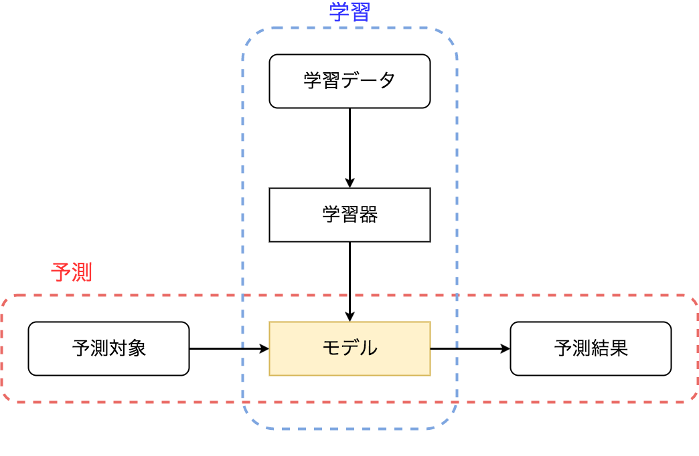

<!-- $theme: gaia -->

## エンジニアとしての

## 機械学習との付き合いかた

##### @yubessy

---

### コモディティ化がもたらしたもの

* Fasttext, TensorFlow, Google Cloud NLP ...
  * ライブラリ -> フレームワーク -> API
* 高度な専門知識がなくてもそこそこの予測モデルが作れる
  * TensorFlow によるキュウリの仕分け
  * https://cloudplatform-jp.googleblog.com/2016/08/tensorflow_5.html

**僕はこの先何で食っていけばよいのか？**

---

### これからの機械学習のお仕事

入口に寄るか出口に寄るか？

* 入口: データサイエンティスト
  * モデルの構築前からかかわる
  * データの取捨選択・UI設計・問題の定式化
* 出口: 機械学習エンジニア
  * モデルの構築後も面倒を見る
  * システム・インフラ設計・継続的な運用
  * **今日はこっちの話**

---

## Q. エンジニアリング視点での
## 機械学習の難しさとは？

---

### 問題: 事前に誤りを防ぐことが困難

* システムの出力の正しさが定義できない
  * そもそも未来に対する予測なので
    「Xを入力してYが出力されたら正解」
    とは誰も言えない
* システムに無謬性を要求できない
  * 100%の精度を実現するのは事実上不可能
  * エラーをどこまで許容するかを考える必要

--- 

### 問題: 結果の解釈・再現・修正が困難

* モデルのブラックボックス化
  * 意図しない結果が出ても何をどう直せばいいかわからない
* 結果の再現の困難さ
  * 再学習しようとしたらDBの状態が変わっている
  * 昨日の予測結果が今日の学習データに影響
* CACE (Changing Anything Changes Everything)
  * e.g. ゴミが1件混じっただけで精度が大幅低下

---

### 実際みんな苦労してる

##### Machine Learning:
##### The High Interest Credit Card of Technical Debt

https://research.google.com/pubs/pub43146.html

> 機械学習は技術的負債の高利子クレジットカード

---

## 何が困難さを生み出すのか？

---

### 図で考える機械学習システム



---

### 一般的なシステムとの違い

* **データ依存性**
  * システムの入出力を決定する関数が
    データを入力とする別の関数によって作られる
  * 予測処理だけをみると巨大な副作用のかたまり
* データ依存性がもたらすもの
  * 関数を人間が直接読み書きできない(≠コード)
  * 結果に対して事前に何かを保証できない

---

## どうやって問題と戦うか？

---

### 先駆者の知見

##### Rules of Machine Learning:
##### Best Practices for ML Engineering 

http://martin.zinkevich.org/rules_of_ml/rules_of_ml.pdf

> To make great products:
> do machine learning like the great engineer you are, not like the great machine learning expert you aren’t.

---

### 未知なるものとの闘い

> 多くの課題はエンジニアリングの領域にある

* 問題に直面したとき
  * 問題を特定し、分割し、パターン化する
  * 既存の仕組みやツールを応用する
* それでも解決できないとき
  * 問題の影響を最小限の範囲に封じ込める
  * 新たな枠組みを作り上げる

---

### 今すぐにできること

* 機械学習特化した開発・運用の体系は未確立
  * -> 問題をよく知られた方法論に落とし込む
* 特に信頼性工学的な手法は相性が良い
  * バージョン管理
  * (自動) テスト
  * CI / CD

---

### 問題発生を未然に防ぐ

* テストの導入
  * 典型的なパターンは通常のテストと同様
  * 境界条件付近ではデータを微妙に替えて水増し
    * 画像 -> アフィン変換
    * テキスト -> 無関係な語の追加
* バックテストによるオフライン検証
  * 過去のデータに対する予測を行って
    既にわかっている結果と比較する

---

### 問題発生後の対処を簡単にする

* モデルだけでなく**データ**のバージョン管理を行う
  * システムの状態を任意の時点に復元可能に
* 継続的なデプロイ
  * モデル改善のサイクルを細かくする
  * -> 問題発生時の原因特定を容易化

---

### 対処療法の先へ

* 問題を個別に解決していくだけでは限界
* 複合的な問題を包括的に扱う仕組みが必要
  * ライブラリ -> フレームワーク
  * コンポーネント -> アーキテクチャ
* 個人的な注目株
  * モデルの表現: PMML, PFA
  * モデルの検証: ソフトウェア基礎論の応用
  * データの管理: ラムダアーキテクチャ

---

### モデルの表現: PMML, PFA

* モデルの計算式をコードで表現
  * -> 静的解析や差分のバージョン管理が可能に

```yaml
input:
  fields:
    - {name: x, type: double}
    - {name: y, type: double}
    ...
output: double
method: emit
action:
  - cast: input.mag
    cases:
      - as: double
        named: magDouble
        do: [{emit: magDouble}]
```

---

### モデルの検証: 型理論の応用

* Dependent Type による精度保証
  * 演算の型にパラメータを指定できる
  * -> 浮動小数点数の演算の精度を保証したり
  * -> 推測統計のp値を型で表現したり
  * -> モデルの出力値の範囲を導いたり？

---

### データの管理: ラムダアーキテクチャ

* 処理のもとになる全てのデータを保存
* 速度と堅牢性を必要に応じて選択できる
* 継続的に運用しても破綻しにくい

http://lambda-architecture.net/

---

## まとめ

* エンジニアからみた機械学習
* データ依存がもたらす困難さ
* 既存の方法論による対処
* これからの注目株

---

## まだまだ仕事はあるぞ！
