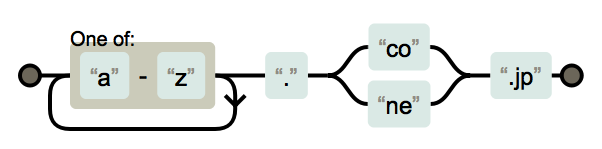
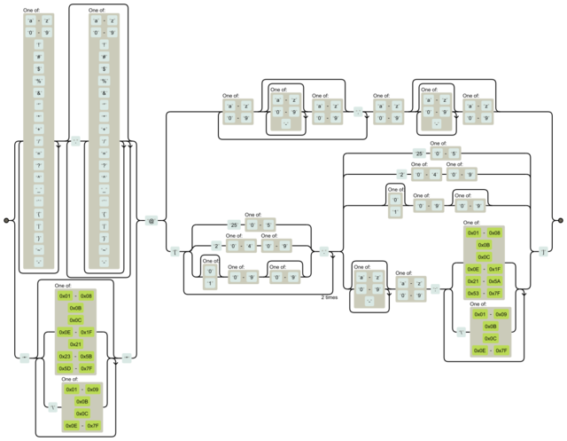

<!-- $theme: gaia -->

## 正規表現のテストカバレッジを

## 測りたかった話

##### @yubessy

##### 0x64物語 Reboot #03 "テスト"

---

### 正規表現書いてますか？

---

### テスト書いてますか？

---

### 正規表現のテスト

↓これをテストしたい

```plain
/[a-z]+\.(co|ne)\.jp/
```

たぶんこんなかんじ

```plain
assert("hoge.co.jp" =~ /[a-z]+\.(co|ne)\.jp/)
assert("hoge.ne.jp" =~ /[a-z]+\.(co|ne)\.jp/)
```

---

### やりたいこと

正規表現のテストカバレッジを測りたい

```plain
/[a-z]+\.(co|ne)\.jp/
```

↓カバレッジが十分でない

```plain
assert("hoge.co.jp" =~ /[a-z]+\.(co|ne)\.jp/)
// "hoge.ne.jp" とかをカバーしてない！
```

ちゃんと言ってほしい！

---

### Q. それくらい見ればわかるやん？

---

### A.


```plain
(?:[a-z0-9!#$%&'*+/=?^_`{|}~-]+(?:\.[a-z0-9!#$%&'*+/=?^_
`{|}~-]+)*|"(?:[\x01-\x08\x0b\x0c\x0e-\x1f\x21\x23-\x5b\
x5d-\x7f]|\\[\x01-\x09\x0b\x0c\x0e-\x7f])*")@(?:(?:[a-z0
-9](?:[a-z0-9-]*[a-z0-9])?\.)+[a-z0-9](?:[a-z0-9-]*[a-z0
-9])?|\[(?:(?:25[0-5]|2[0-4][0-9]|[01]?[0-9][0-9]?)\.){3
}(?:25[0-5]|2[0-4][0-9]|[01]?[0-9][0-9]?|[a-z0-9-]*[a-z0
-9]:(?:[\x01-\x08\x0b\x0c\x0e-\x1f\x21-\x5a\x53-\x7f]|\\
[\x01-\x09\x0b\x0c\x0e-\x7f])+)\])
```

---

### A. RFC5322準拠の email adress

```plain
(?:[a-z0-9!#$%&'*+/=?^_`{|}~-]+(?:\.[a-z0-9!#$%&'*+/=?^_
`{|}~-]+)*|"(?:[\x01-\x08\x0b\x0c\x0e-\x1f\x21\x23-\x5b\
x5d-\x7f]|\\[\x01-\x09\x0b\x0c\x0e-\x7f])*")@(?:(?:[a-z0
-9](?:[a-z0-9-]*[a-z0-9])?\.)+[a-z0-9](?:[a-z0-9-]*[a-z0
-9])?|\[(?:(?:25[0-5]|2[0-4][0-9]|[01]?[0-9][0-9]?)\.){3
}(?:25[0-5]|2[0-4][0-9]|[01]?[0-9][0-9]?|[a-z0-9-]*[a-z0
-9]:(?:[\x01-\x08\x0b\x0c\x0e-\x1f\x21-\x5a\x53-\x7f]|\\
[\x01-\x09\x0b\x0c\x0e-\x7f])+)\])
```

https://emailregex.com/

---

### どうやってカバレッジを測るか？

正規表現 = 状態機械



カバレッジ(C0) = 全てのパスを1度以上通ったか

※C1以上はとりあえず今回は無視

---

### ちなみにさっきのやつ



---

### ここで問題発生

大体の言語では正規表現はライブラリとして提供

-> 内部実装はラップされてしまって見えない

-> 各パスを通った・通らないを知るすべがない

-> **処理系に手を入れるしかない**

---

### 手頃な処理系を探す旅

* ~~PCRE~~ やばい
* ~~java.util.Regexp~~ つらい
* ~~Oniguruma / Onigumo~~ でかい
* ~~Rust~~ おしい（僕の力では読めない）
* **Golang** <- !!!

---

### Golangの正規表現エンジン

* NFA（非決定性有限オートマン）ベース
  * アルゴリズムがわかりやすい
  * 計算量が文字数に対して線形
  * 平均的には遅い
* Pure Go で実装
  * 読みやすい
  * コード量も手頃（エンジン部分は数100行）

<small>https://github.com/golang/go/tree/master/src/regexp</small>

---

### Golangの正規表現エンジン

```go
re := regexp.MustCompile("/[a-z]+\.(co|ne)\.jp/")
re.MatchString("hoge.co.jp")
```

内部では

1. 正規表現文字列をパーツに分解 (`syntax/parse.go`)
2. パーツからプログラムを作成 (`syntax/compile.go`)
3. 文字列に対してプログラムを実行 (`exec.go`)

---

### 正規表現プログラムの内部表現

プログラム = 文字を１コずつ処理する命令の列

`syntax/prog.go`

```go
type Prog struct {
    Inst   []Inst
    ...
}
```

```go
type Inst struct {
    Op   InstOp // 命令の種別
    Out  uint32 // 主にマッチ時のジャンプ先命令の番号を格納
    Arg  uint32 // 主に非マッチ時のジャンプ先命令の番号を格納
    Rune []rune // マッチする文字
}
```

---

### プログラムの内部表現

```plain
 0: InstFail     0  0 []         // 失敗（最初はスキップ）
 1: InstRune     2  0 ['a', 'z'] // 'a' - 'z'
 2: InstAlt      1  3 []         // 命令1, 3のいずれか
 3: InstRune1    4  0 ['.']      // '.'
 4: InstCapture  9  2 []         // ？
 5: InstRune1    6  0 ['c']      // 'c'
 6: InstRune1   10  0 ['o']      // 'o'
 7: InstRune1    8  0 ['n']      // 'n'
 8: InstRune1   10  0 ['e']      // 'e'
 9: InstAlt      5  7 []         // 命令5, 7のいずれか
10: InstCapture 11  3 []         // ？
11: InstRune1   12  0 ['.']      // '.'
12: InstRune1   13  0 ['j']      // 'j'
13: InstRune1   14  0 ['p']      // 'p'
14: InstMatch    0  0 []         // 成功
```

---

### カバレッジの計算

やりたいこと = 正規表現のカバレッジを計る

-> 各命令にテスト済みフラグを立てて数える

```go
type Inst struct {
    Op   InstOp // 命令の種別
    Out  uint32 // 主にマッチ時のジャンプ先命令の番号を格納
    Arg  uint32 // 主に非マッチ時のジャンプ先命令の番号を格納
    Rune []rune // マッチする文字
    Flag bool   // テスト済みフラグ <- new!
}
```

---

### カバレッジの計算

マッチの実行時に通った命令をマーキングしておく

```go
// 命令を1ステップ実行する関数 (exec.go)
func (m *machine) step(...) {
    ...
    switch i.Op {
    ...
    case syntax.InstRune:
        add = i.MatchRune(c)
    case syntax.InstRune1:
        add = c == i.Rune[0]
    ...
    if add {
        i.Flag = true // 文字マッチが成功したらフラグを立てる
    }
    ...
}
```

---


### カバレッジの計算

テストケースを食わせたあとで通った命令を数える


```
func (re *Regexp) Coverage() (int, int) {
    s, a := 0, 0
    for _, x := range re.prog.Inst {
        if x.Op == syntax.InstRune || ... {
            a++
            if x.Flag {
                s++
            }
        }
    }
    return s, a
}

```

---

### カバレッジの計算

できた！！！

```go
func main() {
	re := regexp.MustCompile(`[a-z]+\.(co|ne)\.jp`)
	re.MatchString("hoge.co.jp")
	c, a := re.Coverage()
	fmt.Printf("%d / %d", c, a)
}
```

```plain
7 / 9　
```

※今回は文字マッチ命令だけ数えた

---

### まとめ

* 正規表現のカバレッジは（頑張れば）測れる
* Golangの正規表現実装はわりと簡単に読める
* テスト回のはずが正規表現回になった
