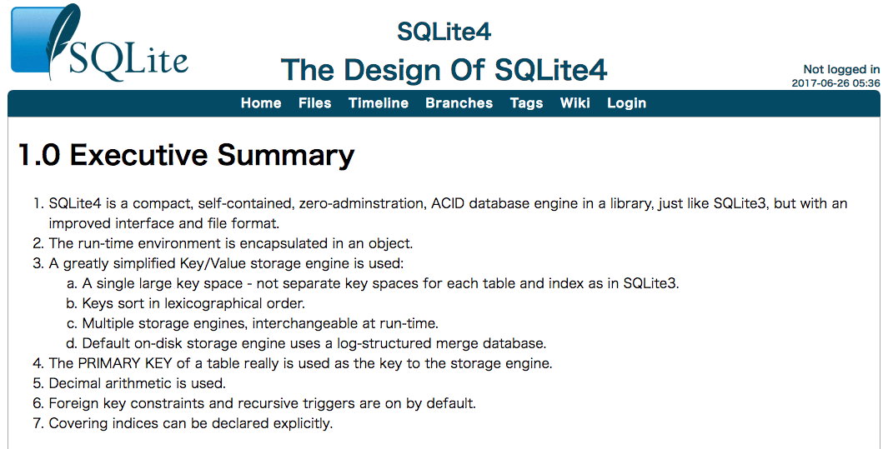

class: center, middle

# あなたの知らない SQLite

@yubessy

0x64物語 Reboot #04 "RDB"

---

class: center, middle

### サーバレス流行ってるよね

---

class: center, middle

### RDBでサーバレスと言えば？

---

class: center, middle


---

## みんな知ってる SQLite

#### 軽量RDBとして

* サーバ不要
* データは単一ファイルorインメモリ
* 様々な言語からライブラリとして使える

#### RDBの基本機能はひと通りもつ

* CRUD
* インデックス, JOIN
* 型: NULL, INTEGER, REAL, TEXT, BLOB

---

## 知ってるかもね SQLite

#### ライセンス

* **パブリックドメイン**
* 様々なアプリケーションに組み込まれている
  * iOS(CoreData), Android
  * WebSQL(凍結), IndexedDB

#### 実はちゃっかり高機能

* トランザクション（スレッドセーフ）
* VIEW, TEMP TABLE, TRIGGER, ...

---

class: center, middle

#### ここから本編

# あなたの知らない SQLite

---

## JSONが扱える

* JSONのパース・値抽出ができる
* 関数・仮想テーブルとして使う
  * プリミティブなデータ型ではない

```sql
> SELECT json_extract(json('{"c":3, "d":4}'), '$.c');
3

> CREATE TABLE json_tbl (j JSON);
> INSERT INTO json_tbl VALUES
    (json('{"attrs": {"a": 1, "b": 2}, "values": [1, 3, 5]}')),
    (json('{"attrs": {"a": 3, "c": 4}, "values": [2, 4, 6]}')),
    (json('{"attrs": null, "values": []}'));

> SELECT tree.value
  FROM json_tbl, json_tree(json_tbl.j, '$.values[1]') AS tree;
3
4
```

---

## CSVにクエリを打てる

* CSVファイルに対する高速なクエリエンジンとして使うことができる
* 拡張モジュールとして提供

```sql
> .load ./csv

> CREATE VIRTUAL TABLE tbl USING csv(filename='example.csv');

> SELECT * FROM tbl;
```

---

## 全文検索ができる

* LIKEとかではなくちゃんと転置インデックスしてる
* フレーズ検索もできる
* 公式: http://www.sqlite.org/fts5.html

```sql
> CREATE VIRTUAL TABLE iamacat USING fts5(sent TEXT);
> INSERT INTO iamacat VALUES
    ('吾輩 は 猫 で ある。名前 は まだ 無い 。'),
    ('どこ で 生れ た か とんと 見当 が つか ぬ 。'),
    ('何でも 薄暗い じめじめ した 所 で ニャーニャー 泣いて いた 事 だけ は 記憶 して いる 。'),
    ('吾輩 は ここ で 始めて 人間 と いう もの を 見 た 。')
  ;

> SELECT * FROM iamacat WHERE sent MATCH '吾輩';
吾輩 は 猫 で ある。名前 は まだ 無い 。
吾輩 は ここ で 始めて 人間 と いう もの を 見 た 。

> SELECT * FROM iamacat WHERE sent MATCH 'どこ 見当';
どこ で 生れ た か とんと 見当 が つか ぬ 。
```

---

## チューリング完全

* MySQLすら8.0まで無かった WITH RECURSIVE が使える
* つまりSQLiteは **チューリング完全** ﾋｬｯﾊｰ!
* 公式: https://sqlite.org/lang_with.html

```sql
WITH RECURSIVE
  xaxis(x) AS (VALUES(-2.0) UNION ALL SELECT x+0.05 FROM xaxis WHERE x<1.2),
  yaxis(y) AS (VALUES(-1.0) UNION ALL SELECT y+0.1 FROM yaxis WHERE y<1.0),
  m(iter, cx, cy, x, y) AS (
    SELECT 0, x, y, 0.0, 0.0 FROM xaxis, yaxis
    UNION ALL
    SELECT iter+1, cx, cy, x*x-y*y + cx, 2.0*x*y + cy FROM m
      WHERE (x*x + y*y) < 4.0 AND iter<28
  ),
  m2(iter, cx, cy) AS (
    SELECT max(iter), cx, cy FROM m GROUP BY cx, cy
  ),
  a(t) AS (
    SELECT group_concat( substr(' .+*#', 1+min(iter/7,4), 1), '')
    FROM m2 GROUP BY cy
  )
SELECT group_concat(rtrim(t),x'0a') FROM a;
```

---

class: center, middle

## demo

---

class: center, middle

### ・・・おや！？ SQLite3 のようすが・・・！

---

class: center, middle



---

class: center, middle

### おめでとう！ SQLite3 は

### SQLite4 にしんかした！

---

## SQLite4

* 2016年に構想発表
  * 3が2004年に発表されてから実に12年
* 2017年現在、まだ設計段階
  * リリース時期も(たぶん)未定
  * 公式: https://sqlite.org/src4/doc/trunk/www/design.wiki
* 今のところ大きな機能追加はない
  * どちらかと言えば内部実装の改善
* 3のリプレースではなく共存を目指す

---

## SQLite3との主な違い

1. 実行環境オブジェクト
  * 接続をより厳格に管理・同一プロセスから複数接続
2. 単純化されたKey/Valueストレージエンジン
  * ストレージエンジンがプラガブルに
3. `PRIMARY KEY` が本当にプライマリキーに
  * 3ではただのユニークキー制約だった
4. 10進数
  * Cの `double` や `float` を使わないことで環境間差異を無くす
5. 外部キー制約と再帰的なトリガーがデフォルトに
6. 明示的な Index Cover

#### 乞うご期待！！！

---

### おまけ: Homebrewで拡張モジュールを使う

* JSONや全文検索はデフォルトではビルドされない
* `--with-xxx` が必要

```shell-session
$ brew info sqlite3
...
==> Options
...
--with-fts
	Enable the FTS3 module
...
-with-json1
	Enable the JSON1 extension
...

$ brew install sqlite3 --with-json1 --with-fts

$ brew link --force sqlite3
```