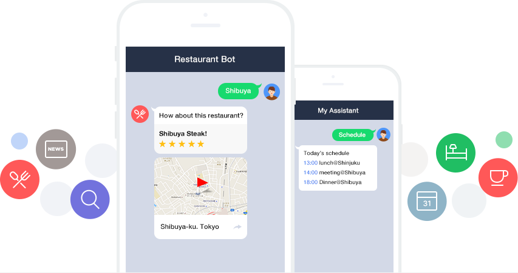
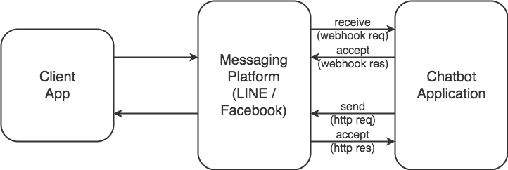
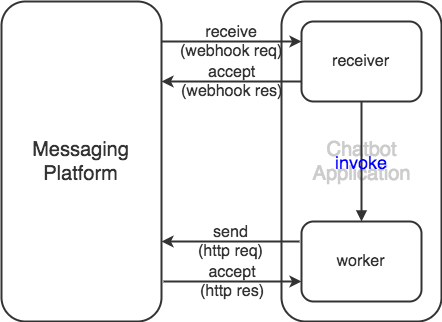
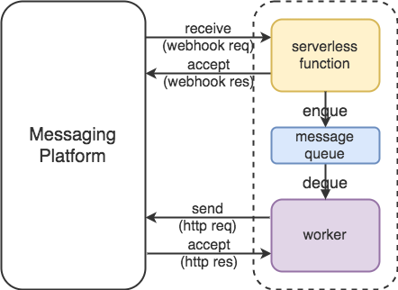

class: center, middle

# 僕とchatbotとサーバーレス

#### @yubessy

#### 0x64物語 Reboot #05 "ポストRails"

---

class: center, middle

## 本日のお題: "ポストRails"

---

## Rails

* Ruby
* MVC

---

class: center, middle

# Railsのはなし

# END

---

## webアプリケーションの多様化

#### REST API, SPA

* ビュー(一枚のHTML)がない

#### log gateway

* モデル(RDB)がない

#### -> MVCが適しない形態の増加

---

## chatbot

---

## chatbotの裏側

* LINE Messaging API / Facebook Messenger Platform
* 双方向・非同期な通信

.center[
    
]

---

## 忙しいwebアプリケーション

#### webhook

* レスポンスタイム制限

#### 重いビジネスロジック

* 外部APIとの通信 (ChatOps)
* 自然言語処理・機械学習

#### bot起点の通信

* 通知
* 一斉配信

---

## ワーカーによる非同期処理

* RailsならActive Jobとか

.center[
    
]

---

## chatbotでの難点

#### ワークロード管理

* 負荷の性質がそれぞれ異なる
    * receiver: 大量のリクエストを高速にさばく
    * worker: 複雑なメッセージ生成処理

#### デバッグのやりにくさ

* 非同期処理
* webhookを受け取るパブリックエンドポイント
    * **ローカルデバッグができない**

---

## そこで: サーバーレス

（すでに誰か説明してると信じて）

.center[
    
]

---

## サーバーレスの利点

#### ワークロード管理

* receiver: 大量のWebhookも楽にさばける
* worker: 重い処理に専念できる

#### デバッグ

* receiver: enqueして200を返すだけ
* worker: サーバーレスでなくてもよい
    * DBコネクションプールしたければ普通のサーバーで
    * キューを介するのでパブリックエンドポイントが不要
    * -> **ローカルデバッグができる！！**

---

## つくってみた

* 諸般の事情によりFacebook Messenger
* 諸般の事情によりAzure Functions
* 諸般の事情によりAzure Service Bus

※AWSならAPI Gateway + Lambda + SQSでいけると思う

---

class: center, middle

# demo

---

## まとめ

* chatbotとサーバーレスは相性が良さそう
* Azure意外と使える
