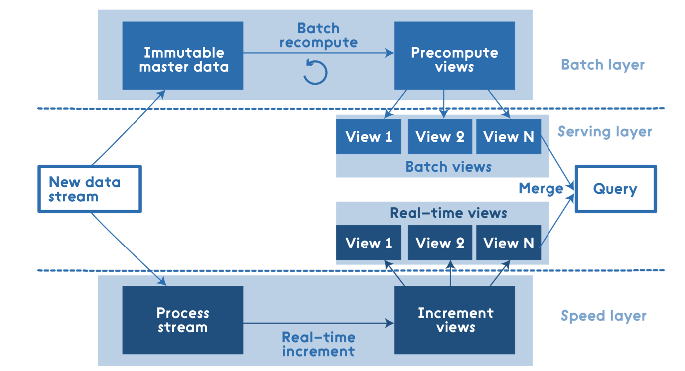

<!-- $theme: gaia -->

## ５分ちょいでわかった気になる

## ラムダアーキテクチャ

##### @yubessy

#### 0x64物語 Reboot #06

#### "システムアーキテクチャ"

---

# Lambda Architecture

---

# Lambda Architecture
# ≠
# 

---

### ラムダアーキテクチャとは？

* = **ビッグデータ処理システム**の設計指針
* 例えるなら:
  * Webアプリの設計指針
    -> MVC
  * ビッグデータ処理システムの設計指針
    -> ラムダアーキテクチャ
* 提唱者: Nathan Marz
  * Apache Stormの開発者

---

### ビッグデータの例

* ログ
  * 最新の状態だけでなく過去の全事象を記録
  * -> 時間に対して線形にデータ量が増加
* ソーシャルネットワーク
  * ユーザ同士がサービス内でつながる
  * -> ユーザ数 n に対して O(n^2) の関係データ

---

### ビッグデータ処理システムの例

* データ分析基盤
  * データドリブンな意思決定を支援する
  * アドホックなクエリにも答えなければならない
* 機械学習基盤
  * データから直接サービスや機能を創り出す
  * 非常に大きな計算量が必要となる

---

### ビッグデータ処理の課題

* スケーラビリティ
  * データ増に応じてリソースを追加
  * RDBでは処理能力が追いつかない
* 堅牢性
  * データ量が多いと耐障害性を保ちにくい
* 汎用性
  * どんな処理が実行されるか事前に予想しにくい

---

### 登場背景

* 従来の状況
  * 個別の課題を対処療法的に解決
  * -> トレードオフによるいたちごっこ
  * -> プロジェクト毎に同じ仕事の繰り返し
* ラムダアーキテクチャ
  * 課題を整理・一般化し、それらを包括的に解決
  * -> トレードオフを統制下に置く
  * -> 一般的な枠組みに昇華

---

### 原理

* **全ての処理はデータ集合に対するクエリ**である
  * KPI分析もレコメンド生成もデータ集合から
    価値を生み出す計算(=クエリ)とみなす
* **クエリはデータに対する関数**である
  * 関数は必要に応じて分割・合成できる
  * -> 計算フローを垂直・水平に分割できる

---

### 全貌

---

### 全貌

* バッチ層
  * 過去からの全データを**マスタデータ**化して蓄積
  * マスタデータから**バッチビュー**を生成
* スピード層
  * 生データを低レイテンシのストリームに流す
  * ストリームから**リアルタイムビュー**を生成
* サービス層
  * ２つのビューからクエリの結果を計算

---

### マスタデータ

* 永続性を必要とする唯一のデータストア
  * ビューが失われてもマスタデータから再生成可
* 純粋な事実データのみを追記方式で記録
  * 他の値から導出できる値は保持しない
  * 削除・更新を行わない(≠RDBのテーブル)
* 分散ファイルシステム(HDFS, S3等)を利用
* スキーマを強制できるフォーマットを利用

---

### バッチビュー・リアルタイムビュー

* 計算量の多いクエリのために事前計算を行う
  * e. g. アクセスログの時間毎・日毎の集計値
* バッチビュー
  * マスタデータに定期的なバッチ処理を実行
  * MapReduce, Apache Sparkなどを利用
* リアルタイムビュー
  * 生データをストリーム集計
  * Apache Storm, Amazon Kinesisなどを利用

---

### ラムダアーキテクチャの利点

* クエリの計算フローを２層に分けることで
  様々なトレードオフを回避
  * 正確性 <-> レイテンシ
  * クエリの自由度 <-> 計算量
* 永続性をマスタデータのみに求めることで
  堅牢性とスケーラビリティを両立
  * 冗長化が容易
  * DBサーバの監視が不要

---

### ラムダアーキテクチャの問題

* マスタデータ
  * スキーマを入念に設計しないといけない
  * RDBとは異なる感覚が要求される
* サービス層
  * バッチビューとリアルタイムビューを
    どうやって統合するか？

---

#### Livesense Analytics と Lambda Architecture

* アクセスログテーブルの生成バッチで導入
* マスタデータ(Amazon S3)
  * (ユーザID, タイムスタンプ, URL) のみを保持
* バッチビュー(Apache Spark on Amazon EMR)
  * visit_id や page_type などはこちらで生成
* リアルタイムビュー: 作ってない
* 読んでね
  * [データ分析を支える「便利カラム」の問題点とその解決策 - LIVESENSE made*](http://made.livesense.co.jp/entry/2017/04/18/090000)

---

### まとめ

* 詳しくは↓をどうぞ

