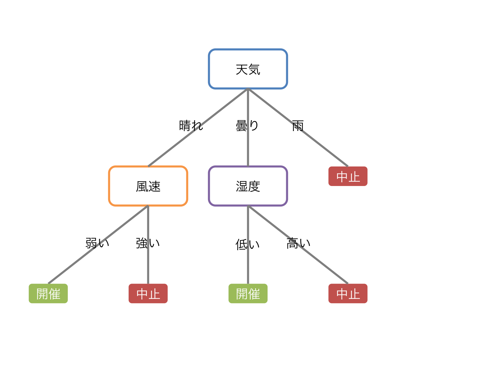
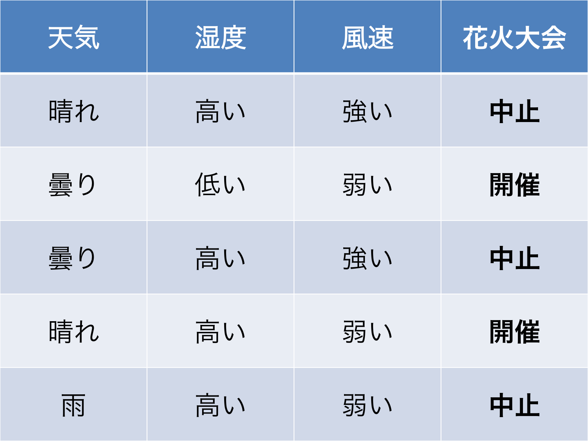
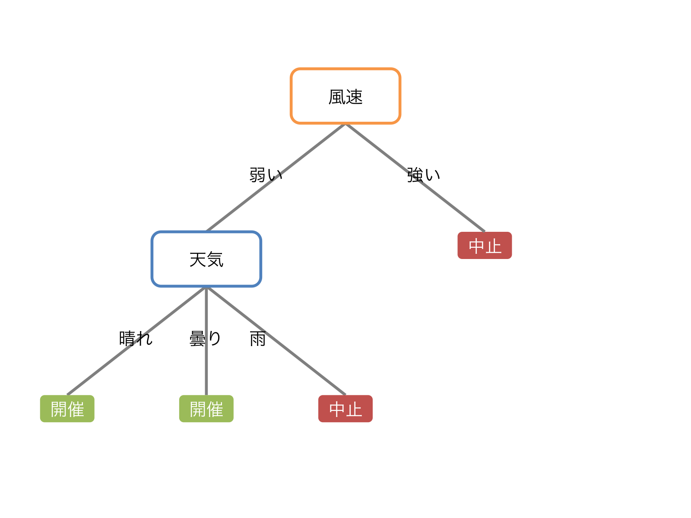
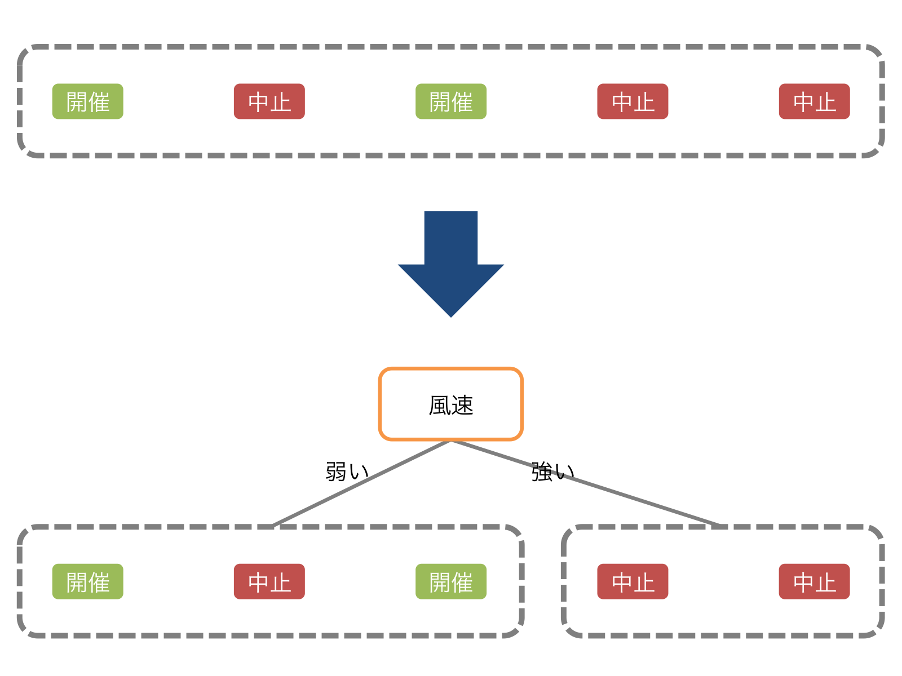

class: center, middle

# 良い木とは何か

#### @yubessy

#### 0x64物語 Reboot #09 "木"

---

class: center, middle

# 木

---

class: center, middle

## 0x64物語史上

# 最 小 画 数

---

class: center, middle

#### ぼくのはなし

# 決定木

---

class: center, middle

## 決定木

例: 花火大会

---

## 決定木

* 決定をするための木
* 説明変数の値から目的変数の値を求める
    * 説明変数: 天気, 風速, 湿度
    * 目的変数: 花火大会を開催するか

#### 決定ステップ

1. １つの説明変数を選択
2. その値に基づいて分岐
3. 1,2を繰り返し、末端に着くと目的変数の値が決定

---

class: center, middle

### 元のデータ

---

class: center, middle

### どうやって作る？

→

---

class: center, middle

### どっちが良い？

---

class: center, middle

### そうだ、機械学習しよう

---

## 決定木学習

* 機械学習の手法のひとつ
* 与えられたデータになるべく当てはまる決定木を生成

#### データ

* (説明変数群, 目的変数) の集合

#### モデル

* 入力: 説明変数群の値
* 出力: 目的変数の値

---

## ID3 (Iterative Dichotomiser 3)

* 代表的な決定木学習アルゴリズム
* 各時点で最大の **情報利得** が得られる説明変数を選択
* 選択した説明変数の値による分岐を繰り返すことで木を生成

#### 情報利得

* データ集合Dを、説明変数Xによって分割することで  
  目的変数Yについての不確かさがどれくらい減るか？
  * X: 天気, 湿度, 風速
  * Y: 花火大会
* 情報利得は **エントロピー** を利用して計算できる

---

## エントロピー

* データ集合Dの複雑さ = Dの **エントロピー**
* D中の異なる種類の要素数が均衡しているほど複雑さが大きい
* `\(P_i\)` : 種類 `\(i\)` の要素がDに占める割合

$$
H(D) = - \sum_{i = 1}^{n} P_i \log_n P_i
$$

* H(😄😄😄😄) = 0
* H(😄😄😄😰) = `\(- (\frac{3}{4} \log_2 \frac{3}{4} + \frac{1}{4} \log_2 \frac{1}{4}) \)` = 0.81
* H(😄😄😰😰) = `\(- (\frac{2}{4} \log_2 \frac{2}{4} + \frac{2}{4} \log_2 \frac{2}{4}) \)` = 1
* H(😄😡😰😰) = `\(- (\frac{1}{4} \log_3 \frac{1}{4} + \frac{1}{4} \log_3 \frac{1}{4} + \frac{2}{4} \log_3 \frac{2}{4}) \)` = 0.94

---

class: center, middle

### 分割するとエントロピーはどうなる？

---

## 情報利得とエントロピー

* 情報利得 = 分割前後の(平均)エントロピーの差

* 分割前: `\(- (\frac{3}{5} \log_2 \frac{3}{5} + \frac{2}{5} \log_2 \frac{2}{5}) \)` = 0.97
* 分割後: `\(\frac{3}{5} ( - (\frac{2}{3} \log_2 \frac{2}{3} + \frac{1}{3} \log_2 \frac{1}{3})) + \frac{2}{5} (0) \)` = 0.55
* 情報利得 = 0.97 - 0.55 = 0.42

---

## ID3

* 各時点で最大の **情報利得** が得られる説明変数を選択
* 選択した説明変数の値による分岐を繰り返すことで木を生成

TODO: 図

---

## ID3 pros/cons

#### pros

* 安定（多少データが入れ替わっても木が変わりにくい）
* 高速（`O(n log(n))` ）

#### cons

* 得られる木が最良であるとは限らない
* 連続値変数にはそのまま適用できない

---

## 参考

http://www.sist.ac.jp/~kanakubo/research/reasoning_kr/decision_tree.html
