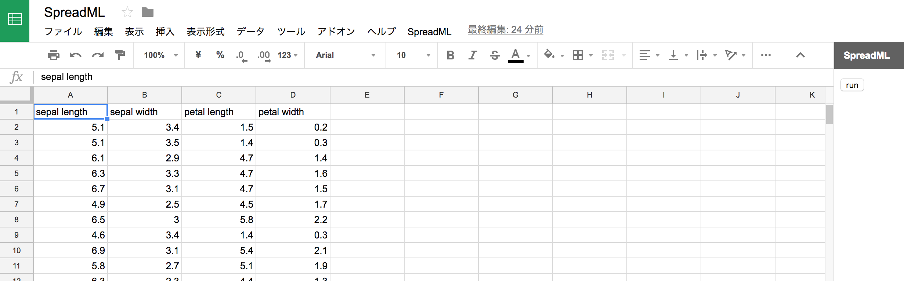

<!-- $theme: gaia -->

### とりあえず機械学習したかった

##### @yubessy

#### 0x64物語 Reboot #11

#### "フロントエンド"

---

### 機械学習したい

---

### フロントエンドで機械学習したい

---

### 先月のぼく

* WebAssembly というものがあるらしい？
* フロントで重い数値計算をサクサク動かせるらしい？？？
* **機械学習** できるのでは！？

---

### 今月のぼく


---

### 

---

### 

---

### 改めて

* WebAssembly で機械学習はまたの機会に
* 昔ちょっとやってお蔵入りになったネタやります

---

### ~~WebAssembly で機械学習~~

### Google Sheets で機械学習

##### @yubessy

#### 0x64物語 Reboot #11

#### "フロントエンド"

---

### Agenda

1. スプレッドシートを作る
2. 「ツール」→「スクリプトエディタ」を開く
3. http://www.numericjs.com/ をコピペする
4. 線形回帰を実装する
5. シート操作ボタンを実装する
6. ボタンを押す

---

### はい

```js
LinearRegression.prototype.train = function (x, y, numIter, alpha, lambda) {
  if (numIter === undefined) numIter = 100;
  if (alpha === undefined) alpha = 0.01;
  if (lambda === undefined) lambda = 0;
  x = U.biased(x);
  var m = x.length;
  var n = x[0].length;
  var theta = U.zeros(n);
  for (var i = 0; i < numIter; i++) {
    var d = N.dot(N.transpose(x), N.sub(N.dot(x, theta), y));
    if (lambda) {
      var r = N.mul(lambda, theta);
      r[0] = 0;
      N.addeq(d, r);
    }
    N.subeq(theta, N.mul(alpha / m, d));
  }
  this._theta = theta;
};
```

---

### はい

```js
function run() {
  N = numeric;
  var ui = SpreadsheetApp.getUi();
  var ss = SpreadsheetApp.getActiveSpreadsheet();
  var dataSheet = ss.getActiveSheet();
  var firstRow = 2;
  var firstColumn = 1;
  var numRow = dataSheet.getLastRow() - firstRow + 1;
  var numColumn = dataSheet.getLastColumn() - firstRow + 1;
  var dataRange = dataSheet.getRange(firstRow, firstColumn, numRow, numColumn);  
  var dataset = U.loadDataset(dataRange.getValues());
  var model = new LinearRegression();
  model.train(dataset.training.x, dataset.training.y, 100, 0.01, 0);
  var predictionY = model.predict(dataset.prediction.x);
  var trainingY_ = model.predict(dataset.training.x);
  var resultSheet = ss.insertSheet(dataSheet.getName() + "_result");
  resultSheet.getRange(1, 1).setValue(dataSheet.getRange(1, 1).getValue());
  var values = U.mergeValues(predictionY, dataset.prediction.idxMap, trainingY_, dataset.training.idxMap);
  var resultRange = resultSheet.getRange(firstRow, 1, numRow);
  resultRange.setValues(values);
}
```

---

### はい



---

# デモ

---

### まとめ

* WebAssembly 無くても線形回帰ぐらいはできる
* スプレッドシートはグラフが作れるので便利
* 実はフロントエンドではない
  * Google App Script はサーバ実行
* すみませんでした

コード: https://github.com/yubessy/SpreadML
