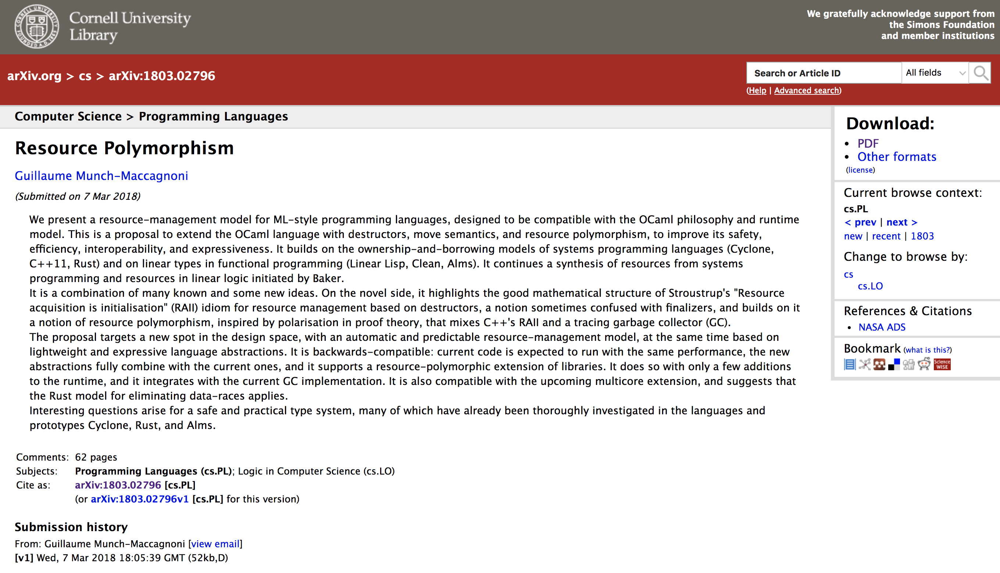

<!-- $theme: gaia -->

### Resource Polymorphism

##### @yubessy

#### 0x64物語 Reboot #13

#### "排他|mutex|ownership"

---

##### ※今日の話は ownership 寄りです

---

### 2018/03/07

#### arXiv.org に突如現れた論文が(その手の)業界を席巻！

---

---

### Resource polymorphism

Author: Guillaume Munch-Maccagnoni (Inria)

> We present a resource-management model for ML-style programming languages, designed to be compatible with the OCaml philosophy and runtime model. ... It builds on the ownership-and-borrowing models of systems programming languages (Cyclone, C++11, Rust) and on linear types in functional programming (Linear Lisp, Clean, Alms).

OCamlのランタイムGCに、Rustに代表される所有・借用モデルを導入！？

---

### Resource

プログラミング言語理論において
**リソース** = コピーや廃棄にコストがかかる値

* (複雑な)構造体
* ファイルハンドラ
* ソケット
* ロック
* ...

これらの組み合わせで構成される値もリソース

---

### Resouce management

リソースはプログラムの至るところで生成される

もしリソースを適切に管理しなければ...？
→ ヒープ領域の圧迫によりプログラムが簡単にOOMで死ぬ

モダンな言語はたいていリソース管理の仕組みを持つ

---

### Resouce management

リソース管理の仕組みとして代表的なもの

#### Garbage Collection

**実行中**に随時不要なリソースを検出・破棄する
Java, Go など多くの言語が採用

#### Ownership and Borrowing

**実行前**にプログラムを解析してリソース破棄処理を挿入する
Rust の他、一部の実験的なFP言語で linear type として採用

---

### Why resource polymorphism ?

GC, OBの一長一短

---

### Why resource polymorphism ?

一長一短があるなら使い分ければ？
→ 実際には難しい

* リソース管理をどうするかは普通は言語の初期設計で決める
* 言語のリソース管理の仕組みを後から変えるのは困難

→ リソース管理が適するかによって

Rust vs. Go の代理戦争

---

### Why resource polymorphism ?

OCaml の思想

> A safe type system that helps instead of hindering

安全で・役に立って・邪魔をしない型システム

自然な発想:

型を使ってリソース管理方法を使い分ければ良いのでは？

---

### Resource polymorphism explained

