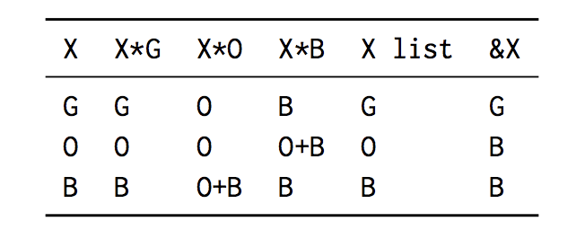

<!-- $theme: gaia -->

### Resource Polymorphism

##### @yubessy

#### 0x64物語 Reboot #13

#### "排他|mutex|ownership"

---

##### ※今日の話は ownership 寄りです

---

### 2018/03/07

#### 突如現れた論文が(僕の中で)話題に！

---

---

### Resource Polymorphism

Guillaume Munch-Maccagnoni (Inria)

> We present a resource-management model for ML-style programming languages, designed to be compatible with the OCaml philosophy and runtime model. ... It builds on the ownership-and-borrowing models of systems programming languages (Cyclone, C++11, Rust) and on linear types in functional programming (Linear Lisp, Clean, Alms).

GCベースのOCamlに所有・借用モデルを導入！？

---

### リソース

ここでは「コピーや廃棄にコストがかかる値」のこと

* 巨大・複雑な構造体
* ファイルハンドラ
* ソケット
* ロック
* ...

これらの組み合わせで構成される値もリソース

---

### リソース管理

リソースはプログラムの至るところで生成される

もしリソースを適切に解放しなければ？

* ヒープ領域を圧迫してプログラムがOOMで死ぬ
* ファイルがロックされ他のプログラムが使えない

こういった事態を防ぐため、モダンな言語は
何かしらのリソース管理の仕組みをもつ

---

### 代表的なリソース管理モデル

#### Garbage Collection (GC)

実行中に随時不要なリソースを検出・解放

Java, Go など多くの言語が採用

#### Ownership and Borrowing (OB)

実行前にプログラムを解析して解放処理を挿入

Rust の他に一部のFP言語で linear type として採用

---

### リソース管理モデルの一長一短

#### Garbage Collection (GC)

pros: プログラマがメモリ管理を考えなくて済む

cons: ランタイムの肥大化, Stop the World (STW)

#### Ownership and Borrowing (OB)

pros: ランタイムが小さい, STWなし

cons: 一定の知識が必要, 複雑な参照があると大変

---

### リソース管理モデルの併用は可能か？

理想: 同じ言語の中でGC, OBを併用したい

* 単純な値 → OBでコンパイル時に解決
* 複雑な値 → GCで自動管理

現実: リソース管理(RM)モデルはたいてい言語依存

* 言語の初期設計段階でどちらかを採用
* 一旦採用したものをあとから変えるのが困難

→ 言語の限界 = RMの限界という誤解 (Rust vs. Go)

---

### Resource Polymorphism

言語研究者としてはこの問題をなんとかしたい

ヒント: リソースは値であり、値には型がある

アイデア: 値の**型**によってGC, OBを選択できないか？

* GC型の値はGCモデルで管理
* OB型の値はOBモデルで管理

これを **Resource Polymorphism** (RP) として提唱

---

### Resource Polymorphism

Resource Polymorphism の実現における課題

* GC, OBの併用が実行の効率に影響しないか？
* GC型とOB型の複合型をどのようにして扱うか？

論文の成果:

GCベースの言語に無理なくOBモデルを導入できる
ことをOCamlによる実装例とともに示す

以降はほんの触りだけ紹介

---

### Resource Polymorphism

まず３つの基本型を導入

* G型: GCで管理
* O型: ownership モデルで管理
* B型: borrowing モデルで管理

これだけなら同一ランタイム内で扱うのは難しくない

* O型, B型はコンパイル時に解放処理を挿入
* G型のみGCで管理

---

### Resource Polymorphism

問題は異なる基本型同士の複合型

* 参照
* 直積, 直和
* タプル, リスト, ツリー, ...

複合型は無限に存在 → 個別に扱いを定義できない

しかし実は少数のパターンをだけ考えればよい！

---

### Resource Polymorphism

例: G型とO型の直積型 `G*O` はO型として処理できる
= `G*O` の値も ownership モデルで管理してよい

特にO, B型と他の型の複合型は `O`, `B`, `O+B` のいずれか

これが(たぶん)一番のポイント

---

#### ※論文はまだまだ続くが・・・

---

### まとめ

* GCとOBの一貫した統合は人類の悲願
* RPでは型の力でこの実現を目指す
* 実用上もGC言語にOBを導入する方法として有力
* 先史時代 → Java帝国 → Rust登場 → **RP** ？
* あと5年くらいしたらトレンドになってるかも？
