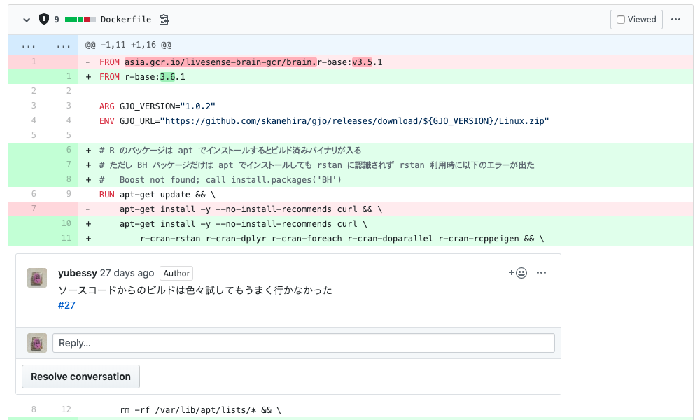
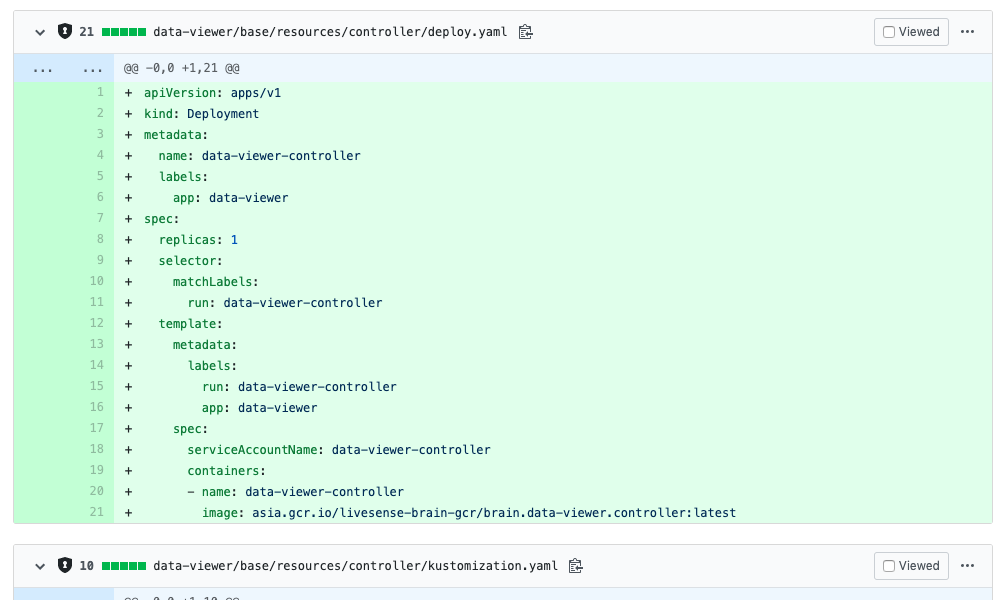
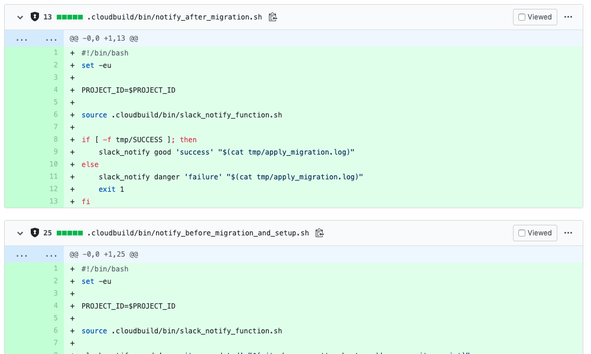
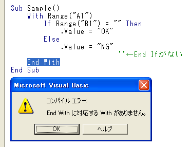

## 終端の歴史学

##### @yubessy

#### 0x64物語 FINAL

---

近況報告

---

時代は MLOps !

---



---



---



---

最近 Dockerfile と YAML と Bash しか書いてません

---

今日は Bash の話をします

---

で、個人的 Bash の気に食わないところ第１位

---

```
if [ ! -s .tmp/changed_apps.txt ]; then
    exit 1
end
^^^

case "$SQL_DRIVERNAME" in
    mysql*      ) mysql -e "source $1" ;;
    postgresql* ) psql -f "$1" ;;
end
^^^
```

---

正:

```
if [ ! -s .tmp/changed_apps.txt ]; then
    exit 1
fi

case "$SQL_DRIVERNAME" in
    mysql*      ) mysql -e "source $1" ;;
    postgresql* ) psql -f "$1" ;;
esac
```

---

なお `do` だけなぜか `done` になる模様

```
for app_name in ${changed_apps}; do
    echo "target: $app_name"
done
```

---

なんだこの一貫性の無さは・・・

というわけで

---

## 終端の歴史学

〜なぜ Bash は fi, esac, done を終端記号に使うのか〜

---

### 終端記号とはなにか

---

とりあえずこう定義します

「トークンAが現れたあと、どこかで必ずトークンBが現れなければならない、というルールが言語の文法上存在するとき、トークンBを終端記号とする」

---

Go なら `}`

```go
for i := 1; i <= 100; i++ {
    if i%15 == 0 {
        fmt.Println("FizzBuzz")
    } else if i%3 == 0 {
        fmt.Println("Fizz")
    } else if i%5 == 0 {
        fmt.Println("Buzz")
    } else {
        fmt.Println(i)
    }
}
```

---

Scheme なら `)`

```scheme
(define (fib n)
  (if (<= n 2)
      1
      (+ (fib (- n 1)) (fib (- n 2)))))
```

---

### なぜ終端記号を使うのか

---

無かったらプログラミングできなくない？

→ そんなことはない

---

Assembly

```assembly
        .global _start
        .text
_start:
        mov     $1, %rax
        mov     $1, %rdi
        mov     $message, %rsi
        mov     $13, %rdx
        syscall

        mov     $60, %rax
        xor     %rdi, %rdi
        syscall
message:
        .ascii  "Hello, world\n"
```

---

（それはさておき）

#### 構造化定理

全ての計算可能関数は 順次・選択・反復 の組み合わせだけで表現可能

→ 多くの命令型言語はこの３つの制御構造を搭載

→ 制御構造の入れ子のブロックを表現するのに終端記号を使う

---

終端記号がなかったら・・・

```c
for (i = 0; i < 5; i++)
    count++;
    printf("count: %d\n", count); // 実はループ外
```

```c
if (c1)
    if (c2)
        printf("aaa");
else
    printf("bbb"); // 実は c1 && !c2 (dangling else)
```

---

なお、終端記号を使わずにブロックを表現する方法もある

代表的なのは Python のオフサイドルール

```python
for i in range(1, 100):
    if i % 15 == 0:
        print("Fizz Buzz!")
    elif i % 3 == 0:
        print("Fizz!")
    elif i % 5 == 0:
        print("Buzz!")
    else:
        print(i)
```

---

### なぜ Bash は fi, esac, done を終端記号に使うのか

---

この記法を初めて使ったのは Algol 68

```algol
FOR i TO 100 DO
    printf(($gl$,
        IF i %* 15 = 0 THEN
            "FizzBuzz"
        ELIF i %* 3 = 0 THEN
            "Fizz"
        ELIF i %* 5 = 0 THEN
            "Buzz"
        ELSE
            i
        FI
    ))
OD
```

（ `OD` ！）

---

Bash のオリジンは Bourne Shell

← Bourne Shell の作者は Stephen R. Bourne

← S. R. Bourne は Algol の開発にも携わっていた

つまり S. R. Bourne の好み（それ以上の理由は見つからなかった）

※ `od` ではなく `done` にしたのは `od` (octal dump) コマンドと被るのを避けたから

---

（余談）

Bourne 先生はこの記法が気に入っていたようで、Cでもこんなマクロを使っていた

```text
#define IF  if(
#define THEN    ){
#define ELSE    } else {
#define ELIF    } else if (
#define FI  ;}
```

ref. http://www.retro11.de/ouxr/211bsd/usr/src/bin/sh/mac.h.html

---

めでたし、めでたし。

---

・・・

ちょっと待った！

---

そもそもなんで終端記号を分けるの？

わざわざ `fi` とか `esac` とか書かなくても、 **全部 `end` で良くない？**

---

### なぜ制御構文ごとに異なる終端記号を使う言語が存在するのか

---

（ぶっちゃけると、よくわかりませんでした・・・）

---

終端記号を同じにしたところで文法上の曖昧性は生じない

Ruby

```ruby
(1..100).each do |i|
    if i % 15 == 0
        puts "FizzBuzz"
    elsif i % 3 == 0
        puts "Fizz"
    elsif i % 5 == 0
        puts "Buzz"
    else
        puts i
    end
end
```

---

系譜は Bash ← Bourne Shell ← Algol

→ Algol と同時期 (~1980) に登場した言語について色々調べた

[Comparison of programming languages (syntax) - Wikipedia](https://en.wikipedia.org/wiki/Comparison_of_programming_languages_(syntax))

---

違う終端記号を使う主な言語

- FORTRAN: `END IF`, `END DO`, ...
- COBOL: `END-READ`, `END-PERFORM`, ...
- Ada: `end if`, `end loop`, `end record`, ...

同じ終端記号を使う主な言語

- LISP: `)`
- Pascal: `end`
- C: `}`
- Smalltalk: `]`

---

違う終端記号を使う言語に共通点はあるか？

- FORTRAN: 科学技術計算用途
- COBOL: 事務処理用途
- Ada: 軍事用途

同じ終端記号を使う言語は？

- LISP: 計算機科学・人工知能研究
- Pascal: プログラミング教育
- C: ハードウェア制御・アセンブラとの親和性
- Smalltalk: 汎用アプリケーション開発

---

（ここからは推測）

特定用途やコンピュータの専門家以外の使用を念頭においた言語で `end *` をしばしば採用

一方、計算機科学やソフトウェア工学由来の言語ではあまり見られない

→ マシンにとっては無意味だが、人間にとってメリットがあるのでは？

---

Ada

```
procedure FizzBuzz is
   i : Integer;
begin
   i := 1;
   for i in Integer range 1 .. 100 loop
      if i mod 3 = 0 and i mod 5 = 0 then
         Put_Line ("Fizz Buzz");
      elsif i mod 3 = 0 then
         Put_Line ("Fizz");
      elsif i mod 5 = 0 then
         Put_Line ("Buzz");
      else
         Put_Line (Integer'Image(i));
      end if;
   end loop;
end FizzBuzz;
```

---

Ada の設計思想

[Ada Reference Manual (2012 Edition)](http://www.ada-auth.org/standards/ada12.html)

> Ada was originally designed with three overriding concerns: program reliability and maintenance, programming as a human activity, and efficiency.

> The need for languages that promote reliability and simplify maintenance is well established. Hence emphasis was placed on program readability over ease of writing.

人間にとっての可読性・保守性を重視していることを強調

---

GNU Octave のように `end` も使えるが `endif` を推奨している言語もある

[Eaton, J.W. (1997) GNU Octave](http://sunsite.univie.ac.at/textbooks/octave/octave_11.html)

> You can use the keyword end anywhere a more specific end keyword is expected, but using the more specific keywords is preferred because if you use them, Octave is able to provide better diagnostics for mismatched or missing end tokens.

理由: 対話型インタプリタのデバッグメッセージをわかりやすくできるから

例: `for ... if ... endfor` になっていたら `if` のほうを閉じ忘れたことがわかる

---

というわけで、個人的結論

- 処理系にとってあまり意味はない
- 可読性・保守性・デバッグ容易性の向上が目的

ただし Bash が可読性・保守性を気にしているかは・・・

---

なお、書き手に `End With` を強制しておきながら無視する処理系もいる



そういうとこやぞ・・・

ref. http://officetanaka.net/excel/vba/error/compilation_error/error_13.htm

---

まとめ

Q. なぜ終端記号を使うのか
A. 制御構文の入れ子などが書きやすいから

Q. なぜ Bash は fi, esac, done を終端記号に使うのか
A. Stephen R. Bourne の好み

Q. なぜ制御構文ごとに異なる終端記号を使う言語が存在するのか
A. たぶん、人間にとっての可読性やデバッグ容易性のため (ただしVBテメーはダメだ)
