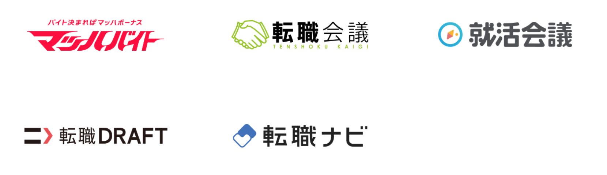
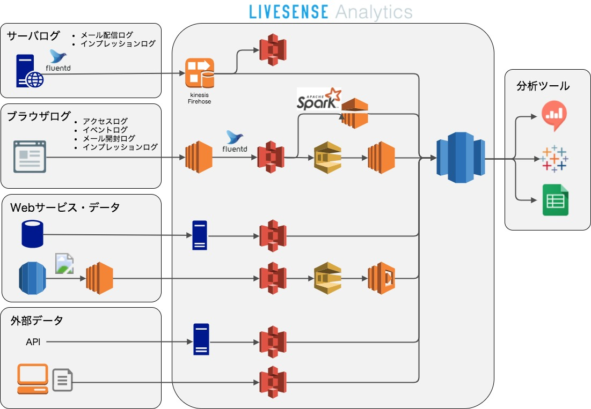
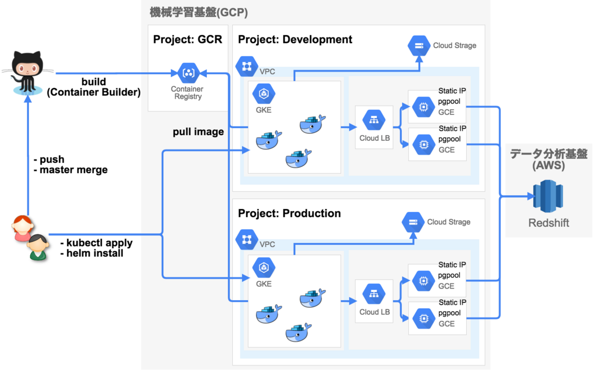

autoscale: true
text: text-scale(0.8), line-height(0.5)

## データを中心とするWebサービスの

## 開発・運用を実現する技術

### 田中 祥太郎 (@yubessy)

#### CAMPHOR x LIVESENSE

#### Webサービスの開発・運用におけるデータエンジニアリング

---

# About me

田中 祥太郎 (@yubessy)

テクノロジカルマーケティング部 データプラットフォームグループ

- 2010 - 2014 京都大学工学部情報学科 計算機科学コース
- 2014 - 2016 京都大学大学院情報学研究科 社会情報学専攻
- 2016 - 株式会社リブセンス
    - データ分析基盤 Livesense Analytics の開発・運用
    - 機械学習基盤 Livesense Brain の開発・運用

---

[.text: text-scale(0.75), line-height(0.5)]

# Works

- [事業に寄り添うデータ基盤の育て方](https://speakerdeck.com/livesense/shi-ye-niji-ritian-udetaji-pan-falseyu-tefang?slide=1)
- [機械学習システムの信頼性エンジニアリング](https://analytics.livesense.co.jp/entry/2018/06/19/090000)
- [データ分析を支える「便利カラム」の問題点とその解決策](http://made.livesense.co.jp/entry/2017/04/18/090000)
- [マルチコンテナ構成による機械学習アルゴリズムとアプリケーションの疎結合化](http://analytics.livesense.co.jp/entry/2017/12/08/105045)
- [機械学習システムの運用課題とコンテナオーケストレーションがもたらすもの](https://yubessy.hatenablog.com/entry/2018/04/16/120000)
- [Apache Sparkの3つのAPI: RDD, DataFrameからDatasetへ](https://yubessy.hatenablog.com/entry/2016/12/11/095915)
- [Facebookの高速ベクトル計算ライブラリfaissをレコメンドAPIに使ってみる](https://qiita.com/yubessy/items/bae2c6c4d1bee0d8fc0b)

---

### 今日伝えたいこと

## サービス開発でなぜデータが重要？

## サービスのデータ活用はどうあるべき？

## データに関わる仕事に求められることは？

---

# その前に

---

## なんのためにサービスをつくるのか？

---

### サービスをつくる理由

## ユーザの役に立って、お金をもらう

---

### リブセンスのサービスは

## どうやってユーザの役に立っている？

## どうやってお金をもらっている？

---

# キーワード : 成果報酬型




---

# たとえば : マッハバイトのしくみ

掲載課金 (他社サービス)

1. アルバイトを雇いたい
2. 求人を掲載 ← **費用発生**

採用課金 (マッハバイト)

1. アルバイトを雇いたい
2. 求人を掲載 ← **無料**
3. 応募者が採用されて初出勤 ← **費用発生**

---

## 成功報酬型

### = サービスの利用開始ではなく目的達成の時点で報酬をもらう

---

### 成功報酬型のメリット

## 採用しなければ費用は発生しない

## = 企業のお金が無駄にならない 😊

---

# デメリットは？

---

### 成功報酬型のデメリット

## 採用しなければ費用は発生しない

## = 掲載がリブセンスの売上にならない 😇

---

# どうする？

---

### リブセンスがやるべきこと

## 掲載だけでなく応募・採用まで成功させる

## = ユーザと企業をうまくマッチングする

---

# どうやって？

---

### リブセンスが注力していること

# データを活用する

---

### 伝えたいこと1

# サービス開発でなぜデータが重要？

---

# データと聞いて・・・

- ビッグデータ, リアルタイムデータ, ....
- データ分析, データサイエンス, ....
- 人工知能, 集合知, ....
- 機械学習, 自然言語処理, ...
- ディープラーニング, ...
- Hadoop, Spark, ...

---

# 一旦忘れてください

---

### そもそも

# Webサービスが扱うデータって？

---

# Webサービスが扱うデータ

**コンテンツ** : サービスがユーザに提供する情報

- アルバイト求人票
- アルバイト先のクチコミ

**ユーザデータ** : サービスがユーザから受け取る情報

- 希望条件 (職種, 勤務地, ...）
- 検索のキーワード
- ページのアクセスログ

---

# ユーザデータはどう役立つ？

---

# ユーザデータの登場

昔のWeb : リンクをたどって自力でコンテンツにたどり着く

- サイトマップ・リンク集
- Yahoo! ディレクトリ検索

Google 検索の登場

- コンテンツにリンクを貼れば Google Bot がクローリング
- ユーザはほしい情報を Google に検索キーワードとして与える

---

# ユーザデータへの注目

ユーザが様々なデータを提供するようになった

- Google, Twitter, Instagram, LINE, ...

データ活用のための技術が発達した

- 大量データの蓄積 : 分散処理, クラウド, ...
- 有用な情報の抽出 : 機械学習, 自然言語処理, ...

### → ユーザデータを利用してコンテンツをうまく届けたい

---

## リブセンスではどう使っている？

---

### たとえば

## 価値の高い求人を見つけやすくする

---

# (再掲) マッハバイトのしくみ

掲載課金 (他社サービス)

1. アルバイトを雇いたい
2. 求人を掲載 ← **費用発生**

採用課金 (マッハバイト)

1. アルバイトを雇いたい
2. 求人を掲載 ← **無料**
3. 応募者が採用されて初出勤 ← **費用発生**

---

## 「価値の高い求人」とは？

---

## ユーザ : 採用されやすい

## 企業 : 応募されやすい

## マッハバイト : 応募 & 採用されやすい

---

## 「価値の高い求人」をどうやって知る？

---

### 「価値の高い求人」の指標

# 応募率・採用率

---

# 応募率と採用率

応募率 = 応募数 / 閲覧数

採用率 = 採用数 / 応募数

求人の価値 ∝ 応募率 ✕ 採用率

- 応募率が高い → ユーザに人気がある
- 採用率が高い → 企業が人を雇いたい

---

## 閲覧・応募がまだゼロなら？

---

### 新着求人の応募率・採用率は計算できない

## → 過去データから機械学習

---

# 応募率・採用率の予測

- アルゴリズム : ロジスティック回帰
- 特徴 : 職種, 勤務地, 店舗数, 休日, シフト数, ...
- 教師 : 過去の多数の求人の閲覧・応募・採用 ← **ユーザデータ (行動ログ)**

$$
\begin{align*}&
    h_\theta (x) = \dfrac{1}{1 + e^{- \theta^T x}}
    \newline \newline&
    J(\theta) = - \frac{1}{m} \displaystyle \sum_{i=1}^m [y^{(i)}\log (h_\theta (x^{(i)})) + (1 - y^{(i)})\log (1 - h_\theta(x^{(i)}))]
\end{align*}
$$

---

### 予測した値をどう使う？

## → 検索結果のランキング

---

# 検索結果のランキング

1. ユーザの検索キーワードにマッチする求人のリストを取得
2. 予め予測しておいた応募率・採用率に基づいてリストを並び替え

```java
public void addDocs(TopFieldDocs mainDocs, int reSortDocsNum)
    throws JsenPageLimitExceedingException, JsenInvalidReSortUnitException {
    int sortUnitIndex = getIndexOf(dhondtUnit, mainDocs.fields);
    this.docCountTable = new DocCountTable(mainDocs.fields, reSortUnits, reSortDocsNum);
    java.util.ListIterator<FieldDoc> iter = fieldDocsIter(mainDocs.scoreDocs, reSortDocsNum);
    HashMap<FieldDoc, Float> reSortedDocs = new HashMap(reSortDocsNum);
    while (iter.hasNext()) {
      FieldDoc doc = iter.next();
      float score = ((Integer) (doc.fields[sortUnitIndex])).floatValue();
      int count = docCountTable.getCountOf(doc);
      reSortedDocs.put(doc, score / (1 + count * dhondtCoef));
      docCountTable.add(doc);
    }
    ArrayList<Entry<FieldDoc, Float>> priorityList = new ArrayList<>(reSortedDocs.entrySet());
    Collections.sort(priorityList, (obj1, obj2) -> obj2.getValue().compareTo(obj1.getValue()));
    this.allDocs = priorityList.stream().map(Entry::getKey).toArray(FieldDoc[]::new);
}
```

---

# Q. 大変じゃない？

---

# A. 大変です

---

# データ活用の難しさ

このシステムは比較的単純な部類

それでも大変なことはたくさんある

- どんなアルゴリズム・特徴を選ぶか？
- 閲覧・応募・採用データをどこから取るか？
- 予測値を検索システムにどう取り込むか？
- 検索結果のソートの計算量をどう減らすか？
- **これが本当にユーザや企業に役に立つのか？**

---

# なんで難しいの？

---

### データ活用を難しくする原因

## システムの不確実性が高い

## 様々な専門性が必要になる

---

# システムの不確実性が高い

普通の場合 = データが変わってもロジックは変わらない

- ロジックはコードだけで決まる
- コードを見れば入力に対する出力はわかる

機械学習 = **データが変わるとロジックが変わる**

- 同じコードでも学習データが違えば別のモデル
- モデルのパラメータは人間が理解しにくい

---

### システムの不確実性が高い

## → サービスインするまで結果が見えない

---

# 様々な専門性が必要になる

典型的なWeb開発

- サーバサイド, フロント, インフラ, アプリ

データを活用したWeb開発

- サーバサイド, フロント, インフラ, アプリ
- 機械学習エンジニア, データエンジニア
- アナリスト, データサイエンティスト

---

### 様々な専門性が必要になる

## → 人材の不足・開発コストの増大

---

# よくある失敗

---

### 偉い人

## 「人工知能でいい感じの成果を出してくれ」

---

### データエンジニア (を任されてしまった人)

## 「アクセスログは全部あります！！！」

---

### 現実

## ファイルサーバに溜まった数万のファイル

## `/var/log/apache.log-2012-05-19.gz`

#### なお、ある日から突然フォーマットが変わる

---

### データサイエンティスト (を任されてしまった人)

## 「このアルゴリズムで精度が100%に！！！」

---

### 現実

## 学習データは40件

## 学習もテストも同じデータ

#### 調べたら決定木アルゴリズムが過学習していた

---

# こうならないために

---

### 伝えたいこと2

## サービスのデータ活用はどうあるべき？

---

## その前に : 大変ならやらなくてよいのでは？

---

[.text: alignment(center), text-scale(0.8), line-height(0.5)]

# データ活用は大変だからやらなくてよい？

冗談ではなく、これも一つの立派な選択

データを使わなくてもサービスがうまくいくならそれでいい

データが無いのにディープラーニングなどに手を出しても仕方ない

逆に言えば、データ活用をやっていくにはそれなりの努力が必要

それでも、データ活用でサービスがより良くなるなら**やるべき**

---

### 解決すべき課題

## 不確実性をうまく扱う

## 専門性を成果につなげる

---

## 不確実性をうまく扱うには？

---

### 不確実性をうまく扱うには？

## → 安全・効率的な開発と検証を可能に

---

# システムの不確実性を扱う方法

不確実性は副作用ではなく、本質的で避けられないもの

不確実性を抑制するのではなく、上手く扱えるようにする

- データが変わるとモデルも変わる → 開発でも本番と同じデータを使う
- データ抽出や整形に手間がかかる → データの場所と前処理を一元化

## → これを可能にするデータ分析基盤をつくる

---

# リブセンスのデータ分析基盤

通称 : Livsense Analytics

- マッハバイト・転職会議・転職ナビなど、各サービスのデータを集約
- コンテンツ (求人情報等) とユーザデータ (行動ログ等) の結合分析を可能に

バックエンド : Amazon Redshift

- 分析用途に特化した列志向型分散データウェアハウス
- レイテンシよりスループットを重視したクエリエンジン
- 500+ テーブル / 100億+ レコード / 100+ 社内ユーザ

---

# Livesense Analytics の全貌



---

# 日々投げられているクエリ

```sql
SELECT
  DATE(n_cpl.pull_at) AS dt,
  CASE
    WHEN n_cpl.pull_condition_id = 47 THEN '1' WHEN n_cpl.pull_condition_id = 48 THEN '2' WHEN n_cpl.pull_condition_id = 49 THEN '3'
    ELSE 'other'
  END AS list,
  COUNT(DISTINCT n_c.id) AS contacts,
  COUNT(DISTINCT CASE WHEN service_start.contact_id IS NOT NULL THEN n_c.id ELSE NULL END) AS agreements,
  COUNT(DISTINCT CASE WHEN application_proxy.summarizable_id IS NOT NULL THEN n_c.id ELSE NULL END) AS agencies,
  COUNT(DISTINCT CASE WHEN cv.id IS NOT NULL THEN n_c.id ELSE NULL END) AS conversions
FROM
  nkd.contact_pull_logs AS n_cpl
  INNER JOIN nkd.contacts AS n_c ON n_cpl.contact_id = n_c.id
  LEFT JOIN (
    SELECT contact_id, staff_id, action_at
    FROM nkd.histories AS n_h
      INNER JOIN nkd.histories_history_actions AS n_hha ON n_h.id = n_hha.history_id
    WHERE n_hha.history_action_id = 1 AND n_h.history_result_id = 1 AND n_h.created_at >= '2017-12-19'
  ) AS service_start ON n_c.id = service_start.contact_id
  LEFT JOIN (
    SELECT *
    FROM nkd.kpi_raw_data
    WHERE name = 'application_proxy' AND created_at >= '2017-12-19'
  ) AS application_proxy ON n_c.member_id = application_proxy.member_id
  LEFT JOIN (
    SELECT id
	FROM nkd.applications
	WHERE recruit_state IN ('hire','pre_hire_confirm_admin')
  ) AS cv ON application_proxy.summarizable_id = cv.id
WHERE
  n_cpl.pull_at >= '2017-12-19'
GROUP BY
  dt, list
;
```

---

## 専門性を成果につなげるには？

---

### 専門性を成果につなげるには？

## → 技術選択の自由度を向上させる

---

# データ活用技術の多様性

課題・目的・得意分野によって適する技術は異なる

本来は各自が100%の力を発揮できる技術を使いたい

- Web開発 : Ruby etc. ↔ データ活用 : Python etc.
- データ活用でも R, Python, Julia などは一長一短

## → 柔軟な技術選択ができる実行環境を整備する

---

# リブセンスの機械学習基盤

通称 : Livsense Brain

- 予測・レコメンドなど各サービスの機械学習システムを実行
- 環境をコンテナ化し、様々なシステムを簡単にデプロイ

バックエンド : Google Kubernetes Engine

- 複数コンテナの実行や協調を可能にするオーケストレーションサービス
- 異なるシステムでもリソースを共有・有効活用
- 16+core CPU / 100+GB RAM / 15+種類 コンテナ

---

# Livesense Brain の全貌



---

# R / Shiny による効果予測Webアプリ


---

# Julia によるレコメンドアルゴリズム実装

```julia
function bpmf(
        users::Vector{Int}, items::Vector{Int}, rates::Vector{Float64},
        N::Int, M::Int, D::Int, n_sample::Int)
    rateidx = sparse(users, items, 1:length(rates))
    U = zeros(n_sample, N, D)
    V = zeros(n_sample, M, D)

    for t in 1:(n_sample-1)
        SS = (1. / N) * ΣXXt(U[t, :, :])
        SU = (1. / N) * sum(U[t, :, :], 1)[:]
        W0ast = inv(inv(W0) + N * SS + (β0 * N) / (β0 + N) * (μ0 - SU) * (μ0 - SU)')
        λ_u = rand(Wishart(ν0 + N, symmetric(W0ast)))
        μ0ast = (β0 * μ0 + N * SU) / (β0 + N)
        μ_u = rand(MvNormal(μ0ast, symmetric(inv((β0 + N) * λ_u))))
        ...

        for i in 1:N
            js = find(rateidx[i, :])
            SV_i = ΣXXt(V[t, js, :])
            λast_inv = inv(λ_u + α * SV_i)
            SVR_i = sum(V[t, js, :] .* rates[rateidx[i, js].nzval], 1)[:]
            μast = λast_inv * (α * SVR_i + λ_u * μ_u)
            U[t+1, i, :] = rand(MvNormal(μast, symmetric(λast_inv)))
        end
        ...
    end
    return U, V
end
```

---

# Q. やっぱり大変じゃない？

---

# A. それなりに大変です

---

[.text: alignment(center), text-scale(0.8), line-height(0.5)]

# 大変だけど・・・

リブセンスでは、これまで多くの試行錯誤を積み重ねる中で

データ活用によりユーザに役立つサービスを作れるようになってきた

高い専門性を駆使してサービスに貢献できる人材も多くいる

異なる専門性を持ったメンバーが協力できるしくみを作り、

それを活かしてサービスをより良くしていきたい

---

### 今日伝えたいこと3

## データに関わる仕事に求められることは？

---

# データ活用と専門性

データに関わる専門分野は非常にたくさんある

- アナリスト, データサイエンティスト, マーケター, ...
- 機械学習エンジニア, データエンジニア, ...

「これができれば全部できる」といった銀の弾丸は存在しない

- Pythonで機械学習だけできればOK → ❌
- Rでデータ分析だけできればOK → ❌

---

# どうやって専門性を身につける？

はたらく人全員が情報系出身でもないし、最初からWebに詳しいわけでもない

とはいえ、誰でも何らかのデータやロジックに触れる機会は意外とある

- 生物系の研究室で、実験データの統計検定をしていた
- 前職が営業で、売上数値をもとに施策を立てていた
- スポーツ活動で、相手チームの戦力分析をしていた

## → 何らかのきっかけからデータに興味を持つ

---

# データとうまく付き合うには？

トレンドに走らず、まずは自分の目的のためにデータをどう使えるかを考える

その上で、自分にできる手段を考えて試行錯誤する

- 今あるデータから、どんな結果が得られれば目的が達成できる？
- そのためにはデータにどんな手法や理論を適用する？
- 今あるデータが不十分なら、どうやれば補うことができる？

最初からうまくいくことは少ないが、上手くいかない理由を考えるのが大事

---

# データに関わる仕事につくには？

実際の仕事でデータがどう使われるか知りたい

→ インターンやアルバイトを活用する

インターン・アルバイト選びのポイント

- 学生だけのハッカソンではなく、実務に関われる機会を見つける
- 「これからやっていきたい」ではなく「すでにやっている」会社を見つける
- データに関わるなら、サポートする仕組みが整っているかを聞いてみる

---

# さいごに

---

## 今日の話に興味を持ってもらえたら…

---

# サマーインターン

- 期間 : 応相談
- 対象 : 機械学習・データ分析・サーバサイド開発の経験者
- 給与 : 時給1200円〜 (交通費支給・遠方の場合は宿泊施設手配)
- 内容例 :
  - クチコミを利用した自然言語処理による新機能の開発
  - Factorization Machine などのアルゴリズムを利用したレコメンド開発
  - GCP上でのABテスト・バンディット基盤の開発

---

### ONE MORE SECRET

---

# 今秋以降 京都でインターン開催予定

- 期間 : 長期・週2〜
- 対象 : データ活用に興味がある大学生・大学院生
- 給与 : 経験・実績に応じて支給
- 内容例 :
  - データ分析基盤 Livesene Analytics の開発・運用
  - 機械学習基盤 Livesene Brain の開発・運用
  - その他希望と経験に応じ、機械学習システムのフルスクラッチ開発等

## COMING SOON

---

# Q & A
