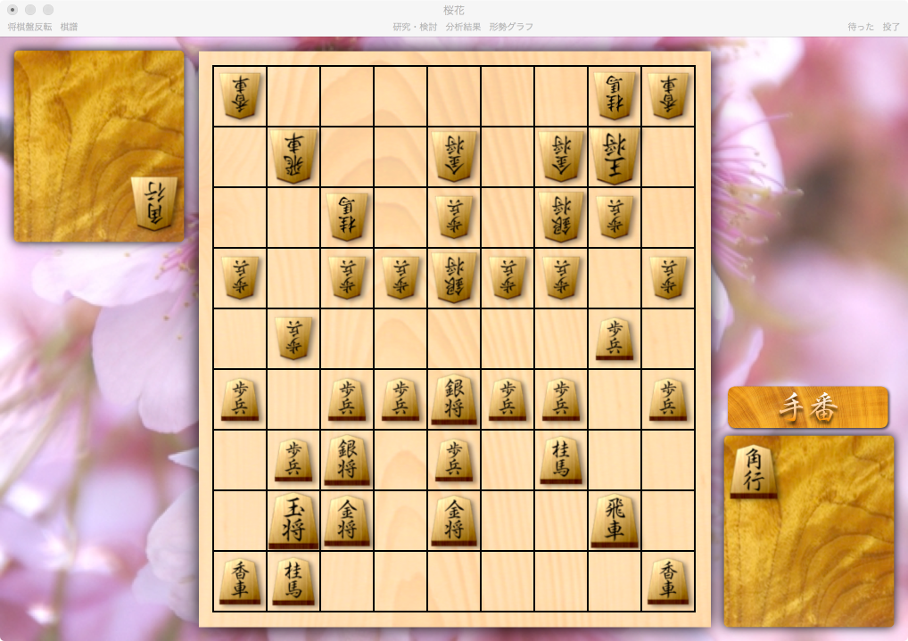
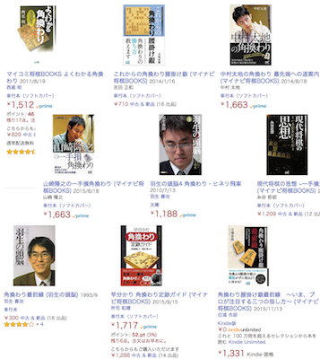
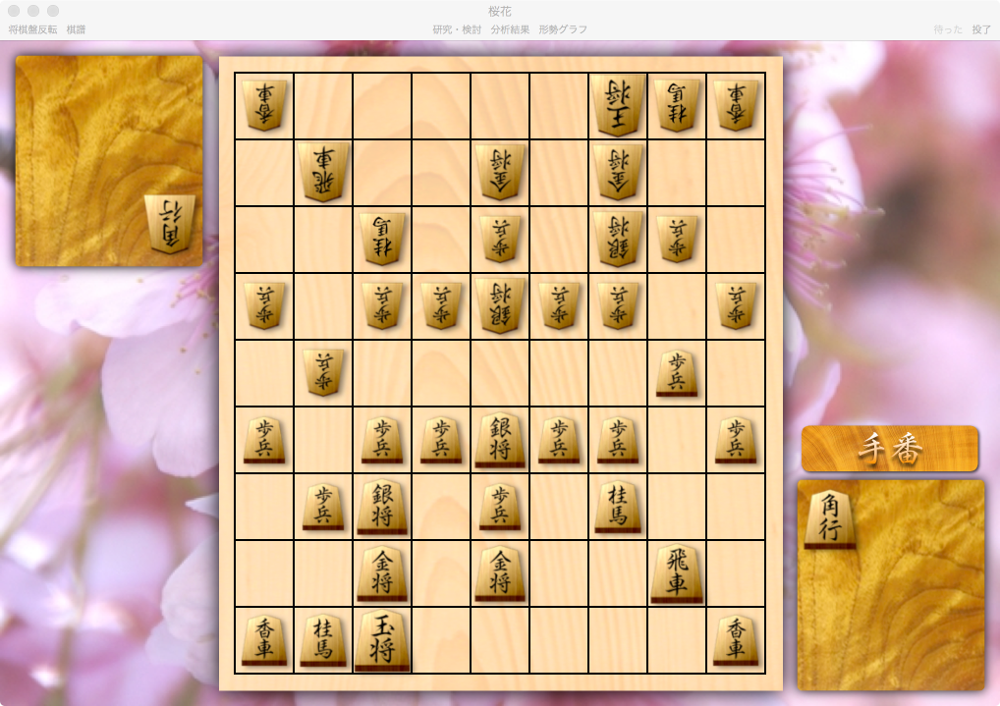
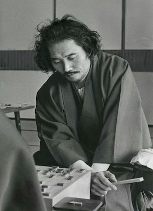
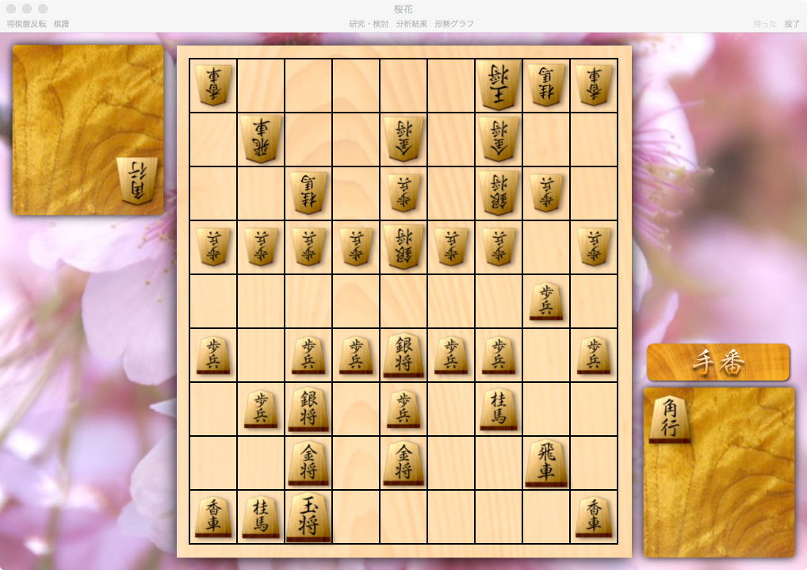
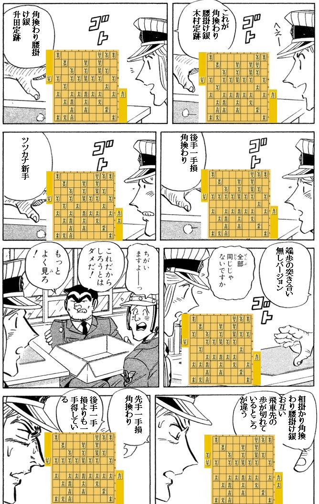

<!-- $theme: gaia -->

## 本当に難しい

# 角換わり腰掛け銀

#### Shotaro Tanaka

##### 本当に難しいお昼ごはん。おかわり。

---

# 問題

---

### Q. どっちが有利？

---

# 

---

## 正解: 先手有利

---

## 正解: ~~先手有利~~

# **先手必勝**

---

### 本日の出発点: 局面X

* Q. 局面Xは重要？
  * 幾何学的できれいに見えるけど・・・
* A. **超重要**
  * 現代将棋の序盤理論が凝縮されているといっても過言ではない

---

### その前に: 戦法と戦型

* どちらも将棋の序盤で頻出する局面や手順のこと
* 戦法
  * 主に**一方の意志**で決まるもの
  * 居飛車 / 振飛車
* 戦型
  * 主に**両者の意志**で決まるもの
  * 相居飛車 / 対抗型 / 相振飛車

---

### 戦型の分類

* 相居飛車
  * 矢倉
  * **角換わり**
  * 横歩取り
  * 相掛かり
* 対抗型
* 相振飛車

---

### 角換わり

* 将棋は角と飛車の可動域を作ることから
* 相居飛車なら
  * `▲７六歩` / `▲２六歩` / `△３四歩` / `△８四歩`
* 角換わりへの手順一例
  * `▲７六歩 △８四歩 ▲２六歩 △８五歩 ▲７七角 △３四歩`
  * このまま角交換に持ち込まれるとまずい
  * `▲６六歩` -> 矢倉へ
  * `▲８八銀` -> **角換わり**へ

---

### 角換わり

* 将棋の最も基本的な戦型の一つ
* Amazonで調べれば10以上の棋書が見つかる



---

### 角換わりの駒組み

* 序盤のセオリー
  * 居玉・玉飛接近は避けよ
  * 攻めは飛角銀桂・守りは金金銀
* 角換わりにおける制約
  * 陣形に隙が生まれると後手に角を打ち込まれる
  * 特に５筋は要注意

---

### 角換わり三大戦法

* 銀の進出路が分類基準
  * 棒銀: ２筋から
  * 早繰り銀: ３筋から
  * **腰掛け銀**: ４筋から
* 三大戦法はジャンケンの関係
  * 棒銀 < 早繰り銀 < 腰掛け銀 < 棒銀 < ...

---

### 本日のテーマ: 角換わり腰掛銀

* お互いに後出しジャンケンを決め込むと？
  * -> 結局は双方とも腰掛銀を選ぶしかない
  * -> **角換わり腰掛銀**
* 現在では ほぼ角換わり = 角換わり腰掛銀
* 定跡化により戦法ではなく戦型とみなされる
  * 両者の意志の均衡点とも言える

---

### 局面Xまでの指し手

* セオリー通り自然な指し手を進める -> 局面Xへ
* 代表的な手順

```
▲７六歩 △８四歩 ▲２六歩 △３二金 ▲７八金 △８五歩
▲７七角 △３四歩 ▲８八銀 △７七角成 ▲同銀 △４二銀
▲３八銀 △７二銀 ▲４六歩 △６四歩 ▲４七銀 △６三銀
▲６六歩 △５二金 ▲５八金 △４一玉 ▲６八玉 △５四銀
▲５六銀 △３一玉 ▲７九玉 △１四歩 ▲１六歩 △９四歩
▲９六歩 △７四歩 ▲３六歩 △４四歩 ▲３七桂 △７三桂
▲２五歩 △３三銀 ▲８八玉 △２二玉
```

---

### 局面Xからの指し手

* 局面Xは駒組みの飽和点 -> 先手が戦端を開く
* 実は `▲４五歩` 以下どの分岐でも先手勝ち！
* 以下一例

```
▲４五歩 △同歩 ▲３五歩 △４四銀(A) ▲７五歩 △同歩
▲１五歩 △同歩 ▲２四歩 △同歩 ▲同飛 △２三歩
▲２八飛 △６三角(B) ▲１三歩 △同香 ▲２五桂 △１四香
▲３四歩 △２四歩 ▲３三桂成 △同桂 ▲２四飛 △２三金
▲１一角 △３二玉(C) ▲３三歩成 △同銀 ▲４四桂 △同銀
▲２三飛成 △同玉 ▲４四角成
```

* どう見ても互角なのに・・・誰が発見？

---

### 十四世名人 木村義雄

# 

---

### 局面Xの正体: 木村定跡

* 木村義雄十四世名人により**昭和30年代**に確立
* 誕生経緯
  * 当時木村は「常勝将軍」と呼ばれるほどの強さ
  * 打倒木村に燃える若手集団が角換わりで挑む
  * 対して木村はひとりで必勝手順を編み出す
* 先手勝ちで間違いない、完成された手順
  * ゆえに現在のプロ対局で現れることはない

---

# ここまで前置き

---

### 木村定跡が遺した課題

「後手のどの指し手が悪かったのか？」

* 先手必勝 = 後手の指し手のどれかが悪手
* `△２二玉` の代わりに `△６五歩` と後手から攻めると？
  * -> ほぼ同じ手順で**後手必勝**に
* その手前の `▲８八玉` を指さなければ？
  * -> **升田定跡**

---

# 

---

### 升田幸三

# 

#### 「名人に香を引いて（香車落ちで）勝った男」

---

### 升田定跡

* 木村定跡の２手前の局面で `▲４五歩` と仕掛ける
* ポイント
  * 玉が攻めから一手遠い
  * -> 後手にも反撃のチャンスが生まれやすい
* 以後約50年間指され続けるも結論が出ず
  * 人呼んで将棋界のリーマン予想

---

### 富岡流: 升田定跡の終焉

* 2010年頃登場
  * ついに升田定跡に終止符が打たれる

```
▲４五歩 △同歩 ▲２四歩 △同歩 ▲１五歩 △同歩
▲７五歩 △同歩 ▲３五歩 △４四銀 ▲２四飛 △２三歩
▲２九飛 △６三金 ▲１二歩 △同香 ▲３四歩 △３八角
▲３九飛 △２七角成 ▲１一角 △２八馬 ▲４四角成 △３九馬
▲２二歩 △同金 ▲３三銀 △同桂 ▲同歩成 △４九馬
▲２二と △４一玉 ▲７四桂 △同金 ▲５三馬 △５八馬
▲７二歩 △同飛 ▲６二歩 △４二金 ▲４五桂 △５三金
▲同桂成 △６二飛 ▲同成桂
```

* 後手玉は必至、先手玉は不詰

---

### 木村・升田定跡の総括

* 現在では木村・升田定跡ともに先手勝ちが定説
* 敗者 = 後手から見たKPT
* Keep
  * 先手の攻めに乗じて戦力を蓄える
* Problem
  * 先手の攻めより速いカウンターが出せない
* Try
  * 反撃の足がかりを予め用意しておく

---

### 局面X'

---

# 

---

### 一手損角換わり

* 升田定跡の形で後手の歩が８四（！？）
  * しかも手番は先手のまま
* メリット = ダイレクトに `▲８五桂` を実現
  * 後手からの素早いカウンターが可能に
* 序盤の角交換における巧妙な手順
  * `▲７六歩 △３四歩 ▲２六歩 △８四歩 ▲２五歩 △８八角成`
  * 先手が `▲７七角` とする前に後手から角を換える
* 将棋の常識（先に陣形を整えれば有利）を覆す

---

### 一手損角換わりの幻想

* 木村・升田定跡の正統な後継になり得るか？
  * -> **NO**
* よく見ると序盤早々に分岐している
  * 正調: `▲７六歩 △８四歩 ... △７七角成`
  * 手損: `▲７六歩 △３四歩 ... △８八角成`
* 一手損は正調とは似て非なる別の戦型
  * いわばパラレルワールド

---

### 木村・升田定跡を継ぐもの

* 富岡流の登場後も多くの修正案が試される
  * 端歩の省略
  * 金の往復による手待ち
* これと言った決定版はない
* 中でも近年最も話題を集めたのが次の局面

---

# 

---

### ツツカナ新手

* 升田定跡の `△３三銀` の前に `△６五歩 ▲同歩` を入れる
  * これにより後にダイレクトに `△６五桂` が実現
  * 意味としては一手損角換わりに似ている
* メリット: 富岡流を回避できる
  * 富岡流と同様に進めると後手が勝ってしまう
* 升田定跡のわずか２手前の修正
* コンピュータソフト「**ツツカナ**」が創案
  * ソフトが定跡を進歩させる時代へ

---

### まとめ

---



---

### ありがとうございました
