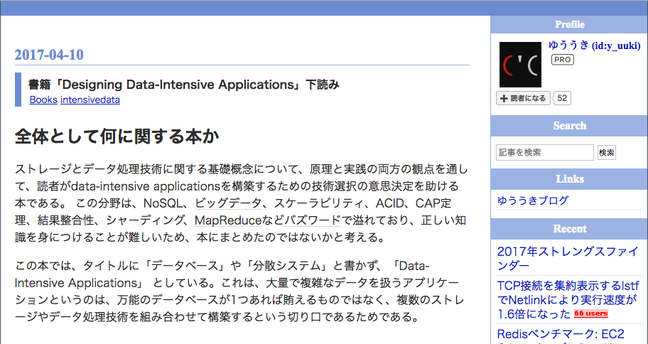
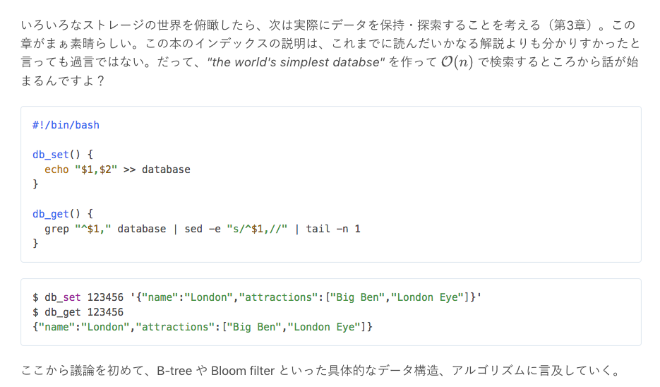

<!-- $theme: gaia -->

# DDIA はいいぞ

## @yubessy

### 新春LT大会 2019

---

# DDIA とは？

---

#### Designing Data-Intensive Applications

# 

---

# 

https://twitter.com/frsyuki/status/846431130437890049

---

# 

https://memo.yuuk.io/entry/2017/04/10/002914

---

# 

https://takuti.me/note/designing-data-intensive-applications/

---

### 目次

- Part 1. Foundations of Data Systems
  - Chapter 1. Reliable, Scalable, and Maintainable Applications
  - Chapter 2. Data Models and Query Languages
  - Chapter 3. Storage and Retrieval
  - Chapter 4. Encoding and Evolution

---

### 目次

- Part 2. Distributed Data
  - Chapter 5. Replication
  - Chapter 6. Partitioning
  - Chapter 7. Transactions
  - Chapter 8. The Trouble with Distributed Systems
  - Chapter 9. Consistency and Consensus

---

### 目次

- Part 3. Derived Data
  - Chapter 10. Batch Processing
  - Chapter 11. Stream Processing
  - Chapter 12. The Future of Data Systems

---

### 良いところ

1. アプリケーション開発者向けの内容である
2. 最もシンプルな実装から解説を始める
3. 複数の技術を比較しながら議論する

---

#### アプリケーション開発者向けの内容である

DBMSや分散処理フレームワークの開発者ではなく
それらの利用者を読者として想定

→ 実現したいアプリケーションのワークロードに
耐えうるシステムの設計指針を与えてくれる

- カラムが多く頻繁に変更されるようなデータでは
  本当にNoSQLを使ったほうが良いか？
- 大量のログをストレージに保存したいとき
  行志向・列志向のどちらの形式にすべきか？

---

タイトルの意味

#### Designing Applications

- アプリケーション設計のための本である
- 技術作る側ではなく、使う側の視点に立つ

#### Data-Intensive

- データに
- ↔ Computing-Intensive

---

#### 最もシンプルな実装から解説を始める

DBMS開発者などには常識としてスキップされがちな
基礎的な概念・アルゴリズムを初歩から丁寧に説明

→ 一般的なアプリケーションエンジニアでも
参考文献や専門家の手を借りずに読み進められる

- 最もシンプルなDBMS実装とは？データの削除や
  読出の高速化のためにはどう修正すればよいか？
- データパイプラインをUNIXコマンドだけで実装
  すると？それをMapReduceにすると何が違う？

---

例: 最もシンプルなDBMS実装

単一ファイルに追記式でデータを書き込むだけ

```sh
#!/bin/bash
db_set() {
  echo "$1,$2" >> database
}
db_get() {
  grep "^$1," database | sed -e "s/^$1,//" | tail -n 1
}
```

```
$ db_set 123456 '{"name":"London"}'
$ db_get 123456
{"name":"London"}
```

ここからcompactionやindexingの概念が導入される

---

#### 複数の技術を比較しながら議論する

各分野について複数の技術・概念を比較説明し
それぞれの差異から生まれる長所・短所を解説

→ 自分のアプリケーションの用途に照らして
技術選択において抑えるべきポイントがわかる

- OLTP vs. OLAP
- 

---

### 読んだ部分

1 → 3 → 2 の順に読み進めている (今 3 の半分くらい)

- Part 1. Foundations of Data Systems
- Part 3. Derived Data
- Part 2. Distributed Data

特に 3 はデータ基盤でよく使われる技術を解説

- Hadoop MapReduce, Spark, Tez, ...
- AMPQ, Pub/Sub, ...

---

# DDIA はいいぞ

